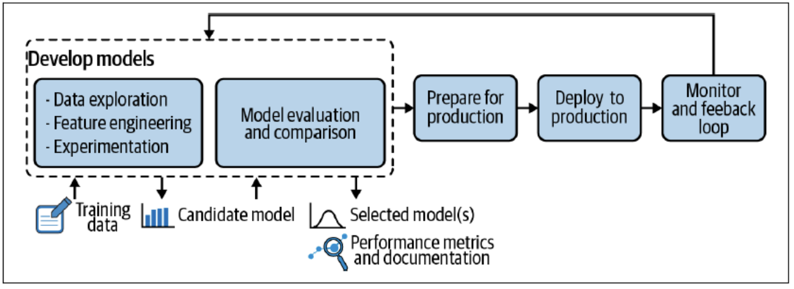

# 7-MLOps

Status: Done
Type: theory

# **Mettere in produzione un modello di ML**

Portare un modello di **Machine Learning (ML) in produzione** è un processo complesso che richiede la gestione di diverse fasi della pipeline, inclusi sviluppo, deployment e monitoraggio.

**Aspetti chiave della messa in produzione**

- Scrivere il modello nel linguaggio adeguato al device o al sistema che lo utilizzerà.
- Allenare periodicamente il modello e monitorare la sua accuratezza, riconoscendo quando inizia a degradare a causa di cambiamenti nel mondo reale.
- Garantire la protezione dei dati utilizzati per il training e il testing del modello.

**Quando utilizzare ML:**

Il ML è utile quando:

- Il problema è **troppo complesso** per essere risolto con regole statiche (es. rilevamento spam).
- Il problema **cambia nel tempo**, rendendo necessaria un’adattabilità continua (es. nuove tecniche di spam).
- Il problema **non è ben definito** e non è possibile stabilire regole precise in anticipo.

**Quando NON utilizzare ML:**

Il ML non è la scelta ideale quando:

- Il costo dell’errore è **troppo alto** e un sistema tradizionale è più affidabile.
- È necessario **sviluppare rapidamente** il codice e non si ha il tempo di portare in produzione un modello ML.
- L’**interpretabilità** del modello è un requisito fondamentale (alcuni modelli di ML sono “black box” → difficili da spiegare).

---

# **MLOps / ML Engineering**

MLOps (Machine Learning Operations) è un insieme di metodologie volte a facilitare la messa in produzione di un modello di **Machine Learning (ML)**, riducendo il tasso di fallimento e migliorando l’affidabilità.

<aside>
⚠️

**Problemi comuni in produzione**

- **Qualità dei dati**: i modelli sono altamente sensibili alla **semantica**, **quantità** e **completezza** dei dati di input.
- **Decadimento del modello**: il modello può perdere efficacia nel tempo, rendendo necessario un aggiornamento periodico.
- **Problemi di località**: un modello pre-addestrato su un dataset specifico potrebbe non funzionare bene in nuovi contesti o per nuovi clienti.

**Scenari critici dopo la produzione**

Dopo aver rilasciato un modello ML in produzione, possono emergere problemi come:

- **Decadimento del modello**: il modello perde accuratezza nel tempo e deve essere riaddestrato con nuovi dati.
- **Dati insufficienti o errati**: se i dati disponibili non sono adatti al problema, può essere necessario ridefinire l’approccio.
- **Ipotesi errate sul training**: il modello potrebbe non funzionare come previsto sugli utenti finali, richiedendo modifiche.
- **Obiettivi aziendali variabili**: un cambiamento nelle esigenze aziendali può richiedere l’uso di un nuovo algoritmo.
</aside>

<aside>

**Pipeline di sviluppo**

Lo sviluppo delle applicazioni basate su Machine Learning (ML) differisce dallo sviluppo del software tradizionale. Nel ciclo di sviluppo di un’applicazione ML, esistono tre livelli di cambiamento che possono influenzare il sistema: 

- Dati
- Modello di ML
- Codice

**Principio di CACE (“Changing Anything Changes Everything”) →** a differenza del software tradizionale, in ML **qualsiasi modifica a uno di questi elementi può influenzare l’intero sistema**.

</aside>

<aside>
💡

**Le fasi del MLO sono:**

1. **Development**: Sviluppo e addestramento del modello.
2. **Preparation for production**: Ottimizzazione del modello per l’ambiente di produzione.
3. **Deployment**: Messa in produzione del modello.
4. **Monitoring**: Monitoraggio continuo per rilevare cali di performance e necessità di aggiornamento.

Queste fasi vengono iterate e il lavoro viene organizzato attraverso **metodologie di governance**, per garantire efficienza e affidabilità nel tempo.

</aside>

---

# 1) Model Development

## a) Data engineering pipeline

La prima fase dello sviluppo di un modello di Machine Learning (ML) consiste nella raccolta e preparazione dei dati, poiché la qualità del dataset influenza direttamente le prestazioni del modello (**“garbage in, garbage out”**).

Il processo di **data engineering** è complesso e richiede tempo, includendo i seguenti passaggi:

1. **Data Ingestion** → fase in cui si crea il dataset accogliendo dati da diverse fonti. Le migliori pratiche includono:
    - **Identificazione delle Fonti di Dati:** trovare i dati e documentarne l’origine (data provenance).
    - **Stima dello Spazio di Archiviazione:** calcolare la quantità di spazio necessaria per conservare i dati.
    - **Acquisizione e Conversione dei Dati:** ottenere i dati e convertirli in un formato compatibile senza modificarne il contenuto.
    - **Backup dei Dati:** lavorare sempre su una copia, lasciando intatto il dataset originale.
    - **Conformità alla Privacy:** proteggere le informazioni sensibili (ad es. tramite anonimizzazione).
    - **Catalogo dei Metadati:** documentare informazioni essenziali sui dati, come dimensione, formato, permessi di accesso ecc.
    - **Creazione di un Test Set:** estrarre un sottoinsieme di test e non analizzarlo in fase iniziale per evitare bias da overfitting (*data snooping*).
    
    <aside>
    🚨
    
    **Problemi comuni nella realizzazione del dataset:**
    
    - **Alto costo**, soprattutto per il *labeling* manuale dei dati.
    - **Bassa qualità dei dati**, che potrebbero non rappresentare accuratamente la realtà.
    - **Rumore nel dataset**, dovuto a errori nei sensori o anomalie nei dati.
    - **Bias**, ovvero polarizzazioni che influenzano le decisioni del modello. Tipologie di bias:
        - Selection Bias (Bias di Selezione) **→**  si verifica quando la scelta delle fonti di dati è distorta perché si usano solo quelle facilmente disponibili, economiche o comode.
        - Self-Selection Bias (Bias di Auto-Selezione) **→**  si verifica quando i dati provengono da soggetti che si sono “auto-selezionati” per partecipare, invece di essere scelti in modo casuale
        - Omitted Variable Bias  **→** si verifica quando manca una variabile importante per la previsione corretta.
        - Sampling Bias / Distribution Shift **→** si verifica quando i dati di addestramento non rappresentano la distribuzione reale dei dati in produzione.
        - Prejudice or Stereotype Bias **→** si verifica quando ****chi analizza i dati tende a interpretare i risultati in base a pregiudizi sociali e culturali.
        - Experimenter Bias **→** si verifica quando chi analizza i dati tende a interpretare i risultati in modo da confermare le proprie ipotesi.
        - Labeling Bias **→** si verifica quando le etichette dei dati sono assegnate in modo soggettivo o influenzato da preconcetti.
    </aside>
    
2. **Data exploration e Validation →**  consiste nell’esplorazione preliminare dei dati per assicurarsi che il dataset sia rappresentativo e adatto all’uso in produzione.
    - **Data profiling:** consiste nel calcolo di metriche descrittive (minimo, massimo, media, deviazione standard, distribuzione dei valori, ecc.), utile per verificare la somiglianza tra i dati di training e quelli di produzione.
    - **Data Validation:** garantisce la qualità e l’integrità dei dati attraverso controlli su:
        - Coerenza → verifica se i valori rispettano determinate regole o formati predefiniti (ad esempio, date valide, numeri all’interno di un intervallo).
        - Completezza → controlla che non ci siano valori mancanti nei campi obbligatori.
        - Accuratezza → confronta i dati con un riferimento noto per assicurarsi che siano corretti.
        - Unicità → verifica che non ci siano duplicati nei campi che dovrebbero contenere valori univoci.
3. **Data Cleaning/Wrangling e Feature Engineering →** Il **data cleaning**  si occupa della rimozione degli outlier, della gestione dei valori mancati e dell’eliminazione di colonne non rilevanti. Inoltre si controlla che non vi sia *class imbalance*, ovvero distribuzione sbilanciata delle classi nel dataset. Questo eventualmente può essere risolto con:
    - **oversampling →** creare nuovi esempi sintetici della classe minoritaria con tecniche come **ADASYN:**
        1. Seleziona un esempio della classe minoritaria $x_i$
        2. Identifica i suoi $K$ vicini più simili $S_k$
        3. Genera un nuovo campione $x_{\text{new}} = x_i +  L \cdot(x_{zi} - x_i)$, dove $x_{zi}$ è la media dei vicini di $x_i$ e $L$  un iperparametro di interpolazione che può assumere valori nel range $[0,1]$
    - **undersampling →** eliminare esempi della classe dominante con metodi come **Tomek Links**, che individua coppie di istanze molto simili ma appartenenti a classi diverse e ne rimuove una per migliorare la separabilità dei dati.
    
    La **feature engineering** consiste invece nell’analizzare e trasformare le feature per migliorare le prestazioni del modello. Aggiungere nuove caratteristiche può essere utile, ma bisogna sempre bilanciare il miglioramento delle performance con la complessità del modello, per evitare overfitting.
    

## b) Training and evaluation del modello

1. **Experimentation:** l’obiettivo è testare diverse configurazioni del modello e giustificare le scelte effettuate nel suo sviluppo.
2. **Evaluating and comparing:** questa fase prevede la scelta dei parametri che controllano il modello e il calcolo delle metriche per valutarne le prestazioni. Fin dall’inizio si stabilisce una soglia di prestazione minima, spesso basata sulle capacità umane nello svolgere lo stesso compito. Nel valutare un modello, si analizzano i tipi di errori che commette e si lavora per ridurre quelli che più allontanano le sue prestazioni da quelle umane.
    
    Esempio:
    
    
    

## c) Reproducibility

Per garantire la riproducibilità del processo, è necessario salvare una quantità sufficiente di dati e adottare un sistema di version control che memorizzi tutti i parametri rilevanti. Ogni aspetto del modello deve essere documentato e riutilizzabile, inclusi:

- **Assunzioni:** tutte le ipotesi fatte durante lo sviluppo.
- **Randomness:** molti algoritmi di ML utilizzano numeri pseudocasuali, quindi è fondamentale controllare e fissare i semi randomici.
- **Dati:** per ottenere ripetibilità, lo stesso dataset deve essere disponibile, il che richiede capacità di storage adeguata. Tuttavia, il versioning dei dati non è ancora avanzato come quello del codice.
- **Impostazioni:** ogni passaggio del processo deve poter essere riprodotto con gli stessi parametri.
- **Risultati:** è essenziale poter confrontare in dettaglio le performance del modello, dalle confusion matrix ai grafici di dipendenza parziale.
- **Implementazione:** anche lievi differenze nelle implementazioni dello stesso modello possono influire sulle predizioni.
- **Ambiente:** un modello non è solo il suo algoritmo e i suoi parametri. Dato il rapido avanzamento del ML, potrebbe essere necessario congelare l’ambiente computazionale per garantire coerenza nel tempo.

## d) Responsible Ai e Fairness

Un modello deve essere **spiegabile**, ossia le sue decisioni devono poter essere giustificate in base alle assunzioni fatte. È fondamentale verificare che il modello non presenti bias e prenda decisioni in modo responsabile, favorendo un’interpretabilità chiara delle sue previsioni.

---

# 2) Preparation for production

Per passare dallo stato di sviluppo a quello di produzione, è necessario eseguire una serie di passaggi:

- **Se l’ambiente runtime di sviluppo e produzione differisce**, è necessario adattare il modello. Questo può comportare la modifica di librerie o addirittura un cambio di linguaggio di programmazione.
- **Controllare nuovamente le performance del nuovo ambiente di produzione**, considerando che in fase di training si usano spesso risorse più potenti rispetto a quelle disponibili in produzione. Ciò può richiedere una semplificazione del modello.
- **Controllare che un modello sia sicuro**, verificando che il modello non esponga dati sensibili, ad esempio evitando la possibilità di risalire ai dati utilizzati per l’addestramento.

---

# 3) Deployment

Il deployment di un modello segue diverse fasi per garantire che il passaggio dallo sviluppo alla produzione avvenga in modo sicuro ed efficiente.

1. **Integration → Delivery**
    - **Scrittura e test del codice**: Uno sviluppatore lavora su una nuova funzionalità o modifica (solitamente in una feature branch di Git).
    - **Code Review e Merge**: Il codice viene sottoposto a revisione e integrato nel ramo principale (main branch).
    - **Test di integrazione**: Dopo il merge, vengono eseguiti test automatici o manuali (unitari, di integrazione, ecc.) per verificare il corretto funzionamento.
    - **Build del modello**: Si genera una build valida del modello o software, pronta per la fase di delivery.
2.  **Delivery → Deployment**
    - **Confezionamento del modello**: Il modello viene impacchettato con tutte le sue dipendenze (es. container Docker, pacchetto distribuito).
    - **Validazione**: Si eseguono test più approfonditi (test end-to-end, validazione con dati di pre-produzione).
    - **Preparazione all’implementazione**: Il modello viene trasferito all’infrastruttura di destinazione (es. cluster Kubernetes, server di produzione, cloud).
    - **Deployment**: Il modello viene avviato nell’infrastruttura target.
3. **Deployment → Release**
    - **Esecuzione su infrastruttura**: Il modello è operativo, ma inizialmente potrebbe essere isolato o non utilizzato per i carichi di lavoro principali.
    - **Test nell’ambiente di produzione**: Si eseguono verifiche finali (es. test A/B, test di fumo) per garantire il corretto funzionamento.
    - **Direzionamento del traffico**: Il traffico di produzione viene gradualmente reindirizzato alla nuova versione.
    
    <aside>
    📌
    
    **Strategie di Passaggio tra Deployment e Release**
    
    - **Blue-Green Deployment →** si installa una nuova versione accanto a quella esistente. Il traffico viene reindirizzato alla nuova versione solo quando questa è completamente funzionante. Se tutto procede senza problemi, il vecchio sistema viene dismesso.
    - **Canary Release →** la nuova versione viene introdotta gradualmente. Il modello stabile resta in produzione, mentre una percentuale del traffico viene indirizzata alla nuova versione. Le prestazioni vengono monitorate e, se i risultati sono soddisfacenti, il passaggio avviene in più fasi, riducendo i rischi di malfunzionamento.
    - **Shadow Model Deployment →** il nuovo modello viene eseguito in parallelo senza impattare il sistema attuale. I suoi output vengono confrontati con quelli esistenti e, solo quando si ha piena fiducia nelle prestazioni, il modello viene attivato ufficialmente.
    
    **N.B.** La tecnica shadow sarebbe la più affidabile anche se richiede molta capacità computazionale.
    
    </aside>
    

---

# 4) Monitoring

Una volta che un modello è in produzione, è importante monitorarlo per assicurarsi che funzioni correttamente ed evitare che se ne accorgano solo i clienti (altrimenti vanno dalla concorrenza).

## a) Monitorare accuratezza delle predizioni

Nel tempo, le prestazioni dei modelli tendono a degradarsi a causa di cambiamenti nei dati o nell’ambiente di applicazione, fenomeno noto come **model drift**. Per questo motivo, è necessario aggiornare regolarmente il modello per mantenerne l’efficacia. 

<aside>

**Quando riallenare un modello?**

La frequenza con cui un modello deve essere aggiornato dipende da diversi fattori:

- **Il dominio →** In settori come la **cybersecurity** o il **trading in tempo reale**, i modelli devono essere aggiornati frequentemente per adattarsi ai cambiamenti costanti. Al contrario, modelli più stabili, come quelli per il **riconoscimento vocale**, richiedono aggiornamenti meno frequenti.
- **Il costo** → Bisogna valutare se il miglioramento delle prestazioni giustifica il costo del riallenamento.
- **Le performance del modello** → Se le prestazioni sono limitate dalla quantità di dati disponibili, l’aggiornamento può essere vincolato alla raccolta di nuovi esempi di addestramento.

**N.B.** Solitamente si fissa un upper bound entro il quale il modello deve essere riallenato per garantire buone performance e si fissa anche un lower bound ovvero una frequenza al di sotto della quale non sarebbe possibile aggiornare il modello, poiché non si disporrebbe di un numero sufficiente di nuove etichette (**labels**) per l’addestramento.

</aside>

<aside>

**Le cause dei drift possono essere molteplici:**

- **Data drift** → si verifica quando la distribuzione dei dati di produzione cambia rispetto a quella dei dati di training. Un metodo per rilevare questo fenomeno consiste nel creare un classificatore che distingua tra dati di training e di produzione: se riesce a separarli con alta accuratezza, significa che sta avvenendo un data drift.
- **Concept drift** → si verifica quando il modello diventa obsoleto perché il contesto è cambiato e i dati di training non riflettono più la realtà attuale. Il concept drift può essere:
    - Graduale → ad esempio, l’impatto del COVID-19 sui modelli economici e sociali.
    - Stagionale → quando il cambiamento segue un ciclo, come le variazioni nelle abitudini di acquisto durante le festività.
</aside>

## b) Monitorare performance del modello

È fondamentale tenere sotto controllo anche la funzionalità e l’efficienza del software. Le metriche da tracciare possono essere suddivise in tre categorie principali:

- **Software metrics** → efficienza del sistema (memoria, calcolo, latenza, carico server).
- **Input metrics** → caratteristiche dei dati in ingresso (lunghezza media, valori mancanti).
- **Output metrics** → qualità delle risposte (errori/null, ricerche ripetute).

---