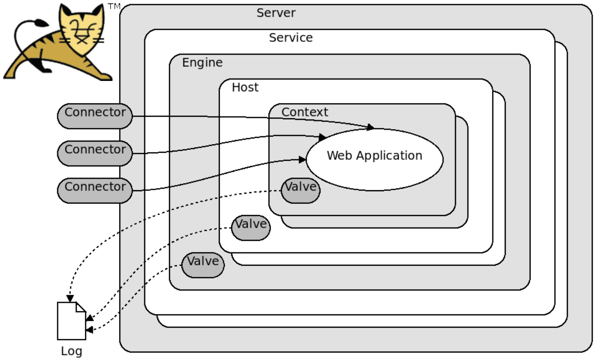
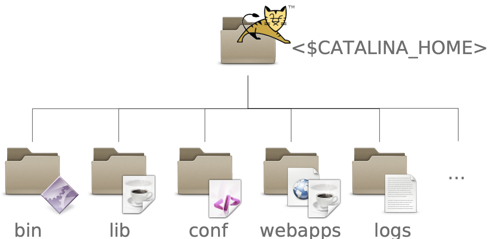

# L3-TOMCAT

Number: 2
Status: Check phase
Type: lab

# 1. Applicazioni Web In Java

Java è un linguaggio:

- **object-oriented**
- **indipendente dalla piattaforma** → il codice sorgente `.java` non viene compilato direttamente in codice macchina nativo, ma in un formato intermedio chiamato **bytecode** `.class`, che viene poi eseguito dalla **Java Virtual Machine (JVM)** invece che dal sistema operativo. Ogni sistema operativo ha la propria JVM, quindi lo stesso bytecode può essere eseguito ovunque senza modifiche.

<aside>
💡

**Servlet**

Le applicazioni web in Java utilizzano le **Servlet**, classi che definiscono metodi per gestire le richieste HTTP provenienti dai client. Per funzionare, le Servlet necessitano di un **Servlet container**, che agisce da intermediario tra il server web e il codice Java dell’applicazione. I principali compiti del Servlet container sono:

- **Gestione del ciclo di vita degli oggetti Servlet** → in particolare inizializza le servlet, gestisce tutte le richieste in arrivo chiamando i metodi appropriati (`service()`, `doGet()`, `doPost()`) e infine li distrugge (`destroy()`) quando il server viene spento o l’applicazione viene rimossa.
- **Gestione delle richieste in multithreading** → permette a più richieste simultanee di essere elaborate dallo stesso oggetto Servlet, assegnando un thread dedicato a ciascuna richiesta. Ottimizza così l’uso delle risorse.
- **Traduzione delle richieste HTTP** → converte le richieste HTTP grezze in oggetti Java (`HttpServletRequest` e `HttpServletResponse`) utilizzabili dal codice dell’applicazione.
</aside>

---

# 2. TOMCAT

**Apache Tomcat** è un’implementazione di **Servlet container**, utilizzata per eseguire applicazioni web Java basate su Servlet e JSP.

## 2.1. Architettura

L’architettura di Tomcat è organizzata come una **gerarchia di componenti nidificati**, che gestiscono il flusso di una richiesta HTTP dal momento in cui arriva al server fino all’esecuzione del codice Java:

1. **Server** → rappresenta l’intera istanza di Tomcat in esecuzione all’interno di una singola **Java Virtual Machine (JVM)** ed è responsabile dell’avvio e dell’arresto del sistema.
2. **Service** → ha il compito di collegare uno o più **Connector** a un singolo **Engine**. I Connector sono i componenti che ascoltano le richieste in ingresso (tipicamente sulla porta **8080** per HTTP o **8009** per AJP) e le traducono in oggetti Java utilizzabili internamente da Tomcat.
3. **Engine** → rappresenta il cuore logico dell’elaborazione delle richieste: riceve il traffico dai Connector e lo instrada verso l’**Host** corretto, il quale rappresenta un host virtuale. 
4. **Host Virtuale** → è l’equivalente di un virtual host di Apache HTTP Server e corrisponde a un **dominio**. All’interno di ciascun Host risiedono uno o più **Context** (o **Web Application**), che rappresentano il livello in cui è definita l’applicazione web Java vera e propria. È qui che si trovano le **Servlet** e le **JSP**, ovvero il codice Java che risponde direttamente alle richieste del client.

Infine, componenti come le **Valve** operano trasversalmente sui vari livelli (Engine, Host, Context) agendo come intercettori. Esse consentono di eseguire operazioni aggiuntive, come logging, autenticazione o compressione, prima o dopo l’elaborazione della richiesta principale. Il **Log** registra gli eventi rilevanti del ciclo di vita del sistema.



<aside>

***Esempio di Istanza Apache Tomcat:***

```python
Server (1 istanza di Tomcat)
 └─ Service (gestisce le porte 8080 / 8443)
     └─ Engine (instrada le richieste)
         ├─ Host (Dominio A)
         │   ├─ Context /app1 (Applicazione 1)
         │   └─ Context /app2 (Applicazione 2)
         └─ Host (Dominio B)
             └─ Context /blog (Applicazione Blog)
```

</aside>

## 2.2. Installazione

Per installare Apache Tomcat è possibile seguire **due approcci principali:**

- **Installazione locale** → viene installato direttamente sul sistema operativo:
    - si scarica l’archivio di Apache Tomcat dal sito ufficiale
    - si estrae (unzip) la directory di Tomcat
    - si avvia il server eseguendo lo script `./bin/startup.sh`
    
    N.B. In questo modo Tomcat viene avviato come applicazione locale e ascolta, di default, sulla porta **8080**.
    
- **Creazione di un Docker dall’immagine di Tomcat** → in alternativa, è possibile eseguire Tomcat all’interno di un container Docker utilizzando l’immagine ufficiale:
    
    ```bash
    docker run -it --name my-tomcat-app -p 8080:8080 tomcat:8.5
    ```
    

## 2.3. FileSystem

In particolare:

- **`/bin`** → contiene i file eseguibili per il controllo di Tomcat, come `startup.sh` e `shutdown.sh`, utilizzati rispettivamente per avviare e arrestare il server.
- **`/lib`** → contiene le librerie e le classi Java necessarie al funzionamento di Tomcat.
- **`/conf`** → contiene i file di configurazione del server. In particolare:
    - `tomcat-users.xml`: definisce utenti, ruoli e password;
    - `server.xml`: contiene le configurazioni globali di Tomcat (porte, connettori, servizi).
- **`/webapps`** → contiene una directory per ogni **web application (Context)**. Ogni directory include Servlet, pagine HTML/JSP e tutte le risorse necessarie all’applicazione web.
- **`/logs`** → contiene i file di log generati da Tomcat, utili per il monitoraggio e il debugging.



---

# 3. Esperienza Lab Apache TOMCAT

L’obiettivo del laboratorio è **porre Apache HTTP Server davanti a Tomcat**, utilizzandolo come **reverse proxy e load balancer**:

- le richieste con **risposta statica** vengono gestite dai **worker Apache** sull’endpoint /cluster
- le richieste con **risposta dinamica** vengono inoltrate ai **worker Tomcat** sull’endpoint /tomcat

Apache si occupa quindi del dispatching e del bilanciamento, mentre Tomcat esegue le applicazioni Java.


## 3.1. Passaggi per creare l’architettura

1. **Creazione dei worker Tomcat con Dockerfile**
    
    
    ```docker
    FROM tomcat:8.5
    ARG workername='RLworker'
    EXPOSE 8080
    EXPOSE 8009
    
    COPY server_new.xml /usr/local/tomcat/conf/server.xml
    RUN mkdir /usr/local/tomcat/webapps/tomcat
    COPY session.jsp /usr/local/tomcat/webapps/tomcat
    RUN sed -i s/NAME/$workername/ /usr/local/tomcat/conf/server.xml
    ```
    
    - `8080` → traffico HTTP
    - `8009` → traffico **AJP** (Apache JServ Protocol)
    - `server.xml` → file di configurazione del **Servlet container**
    - `session.jsp` → pagina dinamica usata per verificare sessioni e routing
    
    Dove `server.xml`:
    
    ```html
    <Server port="8005" shutdown="SHUTDOWN">
    <Connector 
    		port="8080" 
    		protocol="HTTP/1.1" 
    		connectionTimeout="20000"
    		redirectPort="8443
    />
    
    <Engine 
    		name="Catalina" 
    		defaultHost="localhost" 
    		jvmRoute="NAME”
    />
    
    <Host
    		name="localhost" 
    		appBase="webapps" 
    		unpackWARs="true" 
    		autoDeploy="true"
    />
    ```
    
    Dove `session.jsp`:
    
    ```html
    <% @ page session="true" %> <html>
    <head><title>Session in a cluster</title></head>
    <body>
    
    SessionID=<%=session.getId()%> <br/>
    Port=<%=request.getLocalPort()%> <br/>
    URL=<%=request.getRequestURL()%>
    
    </body>
    </html>
    ```
    
2. **Modificare file di configurazione dello switch (**`mod_proxy.conf`**):**
    
    ```python
    LoadModule proxy_module modules/mod_proxy.so 
    LoadModule proxy_http_module modules/mod_proxy_http.so
    LoadModule proxy_balancer_module modules/mod_proxy_balancer.so
    LoadModule lbmethod_byrequests_module modules/mod_lbmethod_byrequests.so
    LoadModule slotmem_shm_module modules/mod_slotmem_shm.so
    
    <Proxy balancer://mycluster>
    	BalancerMember http://httpworker1 route=worker1
    	BalancerMember http://httpworker2 route=worker2
    </Proxy>
    
    ProxyPass /cluster balancer://mycluster/cluster stickysession=MYSESSID
    ProxyPassReverse /cluster balancer://mycluster/cluster
    
    <Location /balancer-manager>
    	SetHandler balancer-manager 
    	Order Deny,Allow 
    	Allow from all 
    </Location>
    
    <Proxy balancer://mytomcat>
    	BalancerMember http://tomcatworker1:8080 route=tomcat1
    	BalancerMember http://tomcatworker2:8080 route=tomcat2
    </Proxy>
    ProxyPass /tomcat balancer://mytomcat/tomcat stickysession=JSESSID
    ProxyPassReverse /tomcat balancer://mytomcat/tomcat
    ```
    
3. **Creazione docker-compose.yaml**
    
    ```yaml
    services:
    [...]
    	tomcatworker1:
    	  build:
    		  context: tomcatworker
    	  image: tomcatworker
    	  container_name: tomcatworker1
    
    	tomcatworker2:
    	  build:
    	    context: tomcatworker
    	  image: tomcatworker
    	  container_name: tomcatworker2
    
    	switch:
    	  build:
    	    context: switch
    	  image: httpswitch
    	  depends_on:
    	    - tomcatworker1
    	    - tomcatworker2
    	    - httpworker1
    	    - httpworker2
    	  ports:
    	    - "80:80"
    	  container_name: switch
    ```
    
4. **Eseguire `docker compose up`**

## 3.2. Traduzione protocollo, da https ad ajp

Per abilitare la traduzione, modifico il file di configurazione dello switch e del server:

File `mod_proxy.conf`:

```python
LoadModule proxy_module modules/mod_proxy.so 
LoadModule proxy_http_module modules/mod_proxy_http.so
LoadModule proxy_balancer_module modules/mod_proxy_balancer.so
LoadModule lbmethod_byrequests_module modules/mod_lbmethod_byrequests.so
LoadModule slotmem_shm_module modules/mod_slotmem_shm.so
LoadModule proxy_ajp_module modules/mod_proxy_ajp.so

<Proxy balancer://mycluster>
BalancerMember http://httpworker1 route=worker1
BalancerMember http://httpworker2 route=worker2
</Proxy>

ProxyPass /cluster balancer://mycluster/cluster stickysession=MYSESSID
ProxyPassReverse /cluster balancer://mycluster/cluster

<Location /balancer-manager>
SetHandler balancer-manager 
Order Deny,Allow 
Allow from all 
</Location>

<Proxy balancer://mytomcat>
BalancerMember ajp://tomcatworker1:8009 route=tomcat1
BalancerMember ajp://tomcatworker2:8009 route=tomcat2
</Proxy>
ProxyPass /tomcat balancer://mytomcat/tomcat stickysession=JSESSID
ProxyPassReverse /tomcat balancer://mytomcat/tomcat
```

File `server.xml`:

```python
<Server port="8005" shutdown="SHUTDOWN">
<Connector 
	port="8080" 
	protocol="HTTP/1.1" 
	connectionTimeout="20000"
	redirectPort="8443
/>

<Connector 
	port="8080" 
	protocol="AJP/1.3" 
	address=”0.0.0.0”
	connectionTimeout="20000"
	redirectPort="8443
/>

<Engine 
	name="Catalina" 
	defaultHost="localhost" 
	jvmRoute="NAME”
/>

<Host
	name="localhost" 
	appBase="webapps" 
	unpackWARs="true" 
	autoDeploy="true"
/>

```

---