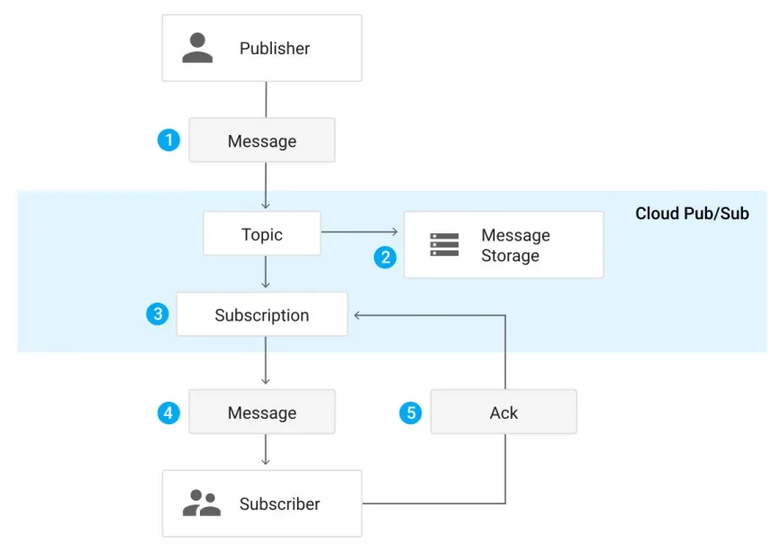

# L7-PubSub

Status: In progress
Type: lab

# 1. Introduzione

<aside>
💡

**Pub/Sub** sta per **Publish/Subscribe pattern** ed è un servizio **event-driven**.

- Il **Publisher** invia messaggi a un **topic** senza conoscere né comunicare direttamente con i destinatari.
- Il **Subscriber** riceve i messaggi dai topic a cui è iscritto.
</aside>

I principali utilizzi sono:

- Raccolta e distribuzione di dati
- Messaggistica in tempo reale

---

# 2. Flusso dei messaggi

1. Il **publisher** pubblica un messaggio su un **topic**
2. Ogni **subscription** collegata al topic riceve una **copia logica** del messaggio.
3. Il messaggio resta nella coda della subscription fino a quando il **subscriber** non lo legge e invia un **acknowledgment**, oppure fino alla scadenza del **retention period**.
4. Quando il subscriber invia l’ack, la subscription cancella il messaggio.

**N.B.** Più subscription sullo stesso topic permettono di gestire chi riceve i messaggi, quante volte li riceve e con quale stato.

<aside>
📌

**Notifica dei Messaggi**

Ci sono due meccanismi principali di notifica dei messaggi:

1. **Pull** → l’applicazione subscriber fa richieste HTTPS di tipo pull alla propria subscription. Ideale per subscriber con risorse limitate o variabili, poiché può decidere *quando* e *quanti* messaggi processare.
2. **Push**  → l’applicazione subscriber espone un endpoint HTTPS e la subscription a cui è iscritto esegue la push su quel endpoint. Riduce traffico inutile perché non ci sono richieste “a vuoto” quando non ci sono messaggi ma richiede che il subscriber sia **raggiungibile pubblicamente** o tramite una rete condivisa e sia pronto a gestire **picchi di traffico**.
    
    **N.B.** I **Push subscriber** sono definiti come **webhook**, cioè **server o applicazioni che espongono un URL accessibile via Internet** e ricevono notifiche tramite POST.
    
</aside>



---

# 3. Pricing Pub/Sub di gcloud

- I primi **10 GB** di dati trasmessi sono gratuiti.
- Oltre i 10 GB, il costo è **$40 per TiB**.
- Nel calcolo dei byte trasmessi non viene considerato solo il **body del messaggio**, ma anche: timestamp, key e value degli **attributes** e tutte le altre informazioni inviate al server Pub/Sub.

---

# 4. Pub/Sub su gcloud

## 4.1. Setup

1. Creare un account **webuser** con permessi di **Owner** (per avere i permessi di modificare il servizio PubSub).
2. Salvare le credenziali in credentials.json e impostare la variabile d’ambiente:
    
    ```bash
    export GOOGLE_APPLICATION_CREDENTIALS="$(pwd)/credentials.json"
    ```
    

## 4.2. Creazione del Topic

```bash
export TOPIC=cpu_temperature
gcloud pubsub topics create ${TOPIC}
```

Per controllare i topic attivi:

```bash
gcloud pubsub topics list
gcloud pubsub topics describe ${TOPIC}
```

## 4.3. Creazione SubScription Pull

```bash
export SUBSCRIPTION_NAME=cpu_sub
gcloud pubsub subscriptions create ${SUBSCRIPTION_NAME} --topic ${TOPIC}
```

Per testare da CLI la subscription, pubblicare:

```bash
gcloud pubsub topics publish ${TOPIC} --attribute=from="cli" --message="Test Message"
```

E leggere facendo pull:

```bash
gcloud pubsub subscriptions pull ${SUBSCRIPTION_NAME}
```

## 4.4. Codice del Publisher

Si importa la libreria `pubsub_v1`, questa libreria permette di:

- Definire il publisher: `publisher = pubsub_v1.PublisherClient()`
- Definire il path del topic su gcloud: `topic_path = publisher.topic_path(project_id, topic_name)`
- Pubblicare sul topic: `res = publisher.publish(topic_path, json.dumps(data).encode('utf-8'))`

***Codice completo:***

```python
import time, json, os
from datetime import datetime
from google.cloud import pubsub_v1

update_interval = 5.0
topic_name = os.environ.get('TOPIC', 'cpu_temperature')
project_id = os.environ.get('PROJECT_ID', 'myprj')

publisher = pubsub_v1.PublisherClient()
topic_path = publisher.topic_path(project_id, topic_name)

def notify_cpu_temp(temp):
    now = datetime.now()
    data = {'timestamp': now.timestamp(), 'time': str(now), 'temperature': temp}
    res = publisher.publish(topic_path, json.dumps(data).encode('utf-8'))
    print(data, res.result())

if __name__ == '__main__':
    while True:
        notify_cpu_temp(get_cpu_temp())
        time.sleep(update_interval)
```

## 4.5. Codice del Subscriber

Si importa la libreria `pubsub_v1`, questa libreria permette di:

- Definire il subscriber: `subscriber = pubsub_v1.SubscriberClient()`
- Definire il path della subscription su gcloud: `subscription_path = subscriber.subscription_path(project_id, subscription_name)`
- Far iscrivere il client ad una subscription: `pull = subscriber.subscribe(subscription_path, callback=callback)`
    
    Al momento della subscription, è possibile definire una callback function che viene chiamata ogni volta che viene ricevuto un messaggio:
    
    ```python
    def callback(message): 
    	message.ack() 
    	try:
    			save_temperature(json.loads(message.data.decode('utf-8'))) 
    	except: 
    			pass
    ```
    
- Leggere lo stream di messaggi associati alla subscription:
    
    ```python
    if __name__=='__main__': 
    	pull = subscriber.subscribe(subscription_path, callback=callback) 
    	try: 
    		pull.result()
    	except: 
    		pull.cancel()
    ```
    
    Dove:
    
    - `subscriber.subscribe(subscription_path, callback=callback)` **→**  iscrive il subscriber alla subscription e associa la funzione callback che viene chiamata **ogni volta che arriva un messaggio**.
    - `pull.result()` → blocca il thread principale e fa sì che il subscriber resti **in ascolto continuo** dei messaggi in arrivo. Ogni volta che un messaggio viene ricevuto viene chiamata la callback function. Puoi specificare un **timeout**, ad esempio pull.result(timeout=30), per limitare il tempo di ascolto a 30 secondi.
    - `pull.cancel()` → ferma l’ascolto dello stream quando si verifica un errore (es. TimeoutError) oppure quando si preme Ctrl+C per interrompere manualmente il programma.
    
    ***Codice completo:***
    
    ```python
    import os
    import json
    import datetime
    from google.cloud import pubsub_v1
    from google.cloud import firestore
    
    subscription_name=os.environ['SUBSCRIPTION_NAME'] if 'SUBSCRIPTION_NAME' in os.environ.keys() else 'cpu_temperature'
    project_id=os.environ['PROJECT_ID'] if 'PROJECT_ID' in os.environ.keys()  else 'myprj'
    
    subscriber = pubsub_v1.SubscriberClient()
    subscription_path = subscriber.subscription_path(project_id, subscription_name)
    db = firestore.Client()
    
    def save_temperature(data):
            dt=datetime.datetime.fromtimestamp(data['timestamp'])
            docname=dt.strftime('%Y%m%d')
            print(docname, data['temperature'])
            db.collection('temperature')
    		        .document(docname)
    		        .set({str(data['timestamp']): data['temperature']}, merge=True)
    
    def callback(message):
        message.ack()
        try:
            save_temperature(json.loads(message.data.decode('utf-8')))
        except:
            pass    
    
    if __name__=='__main__':    
        pull = subscriber.subscribe(subscription_path, callback=callback)
        try:
            pull.result()
        except:
            pull.cancel()
    ```
    

## 4.6. Creazione SubScription Push

```bash
export TOPIC2=cpu_temperature_alert
gcloud pubsub topics create ${TOPIC2}
gcloud pubsub topics describe ${TOPIC2}
```

```bash
export TOKEN="123token"
export SUBSCRIPTION_NAME2="cpu_alert_sub"

gcloud pubsub subscriptions create ${SUBSCRIPTION_NAME2} 
  --topic ${TOPIC2} 
  --push-endpoint "https://${PROJECT_ID}.appspot.com/pubsub/push?token=${TOKEN}" 
  --ack-deadline 10
```

---