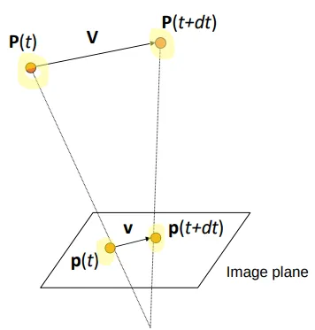
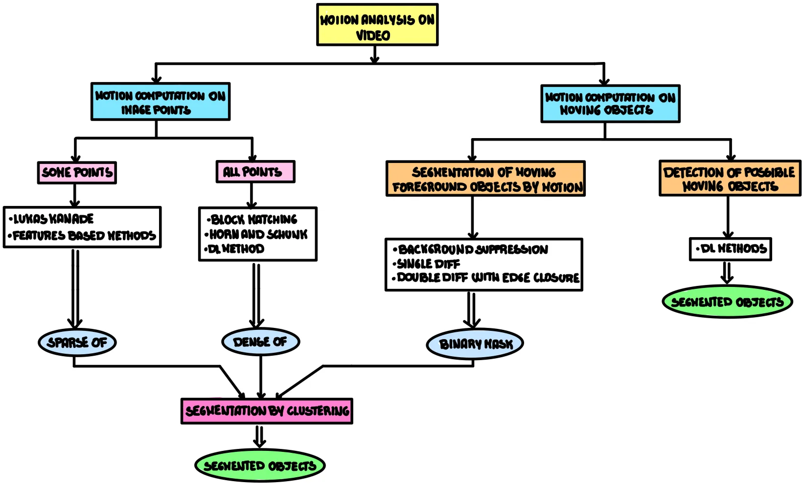
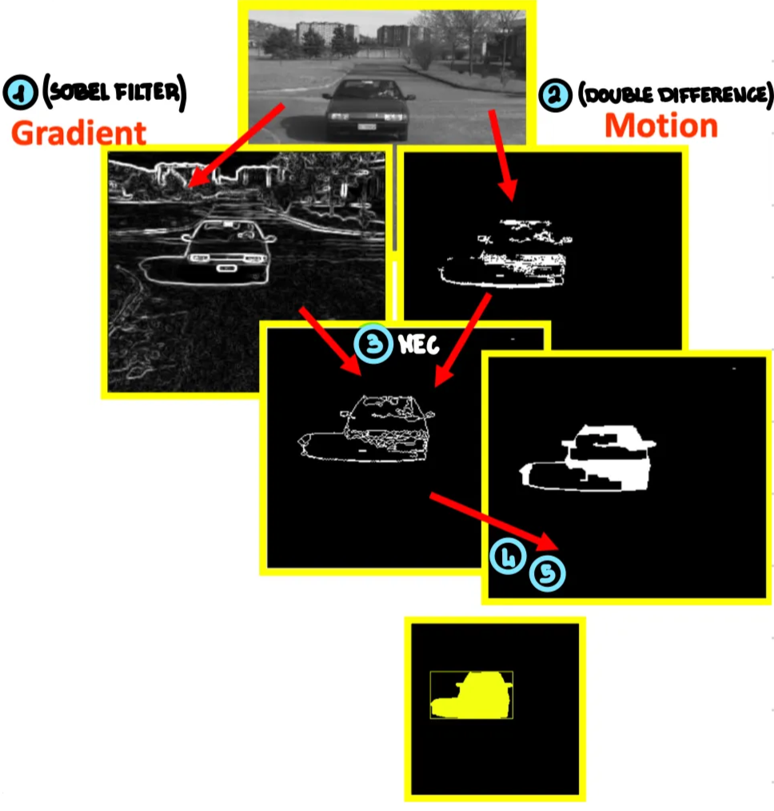

# 6-Motion

Done?: Done
Select: theory

# 1. Video

<aside>

A video is modeled as a **sequence of frames** captured at discrete time intervals $\Delta t$. If the frame rate $D_t= t_{k+1}-t_k$ is **constant** for $k = 0 ...,n−1$, a video $V(x, y)$ can be represented as: 

$$
V(x,y) = [f_0(x,y),f_1(x,y) ...f_{n−1}(x,y)]\quad \text{where each }f_k(x,y) \text{ is a frame at time }t_k
$$

Video data is typically **very large**. For instance, a video with frames of $1024×1024$ pixels, $3$ color channels, recorded at 25 frames per second (fps), results in:  $(1024 \times 1024\ \text{pixels}) \times(3\ \text{color layers}) \times(25\ \text{frames per second}) = 75\ \text{Mbyte}$.

This highlights the massive data processing requirements in video analysis.

</aside>

## 1.1. Video acquisition system

Understanding the type of video acquisition system is essential, as it strongly influences motion estimation:

- **Fixed camera →** camera doesn’t move. Any observed motion in the video comes only from moving objects.
- **Moving Camera with Constrained Motion** → camera can move, but its motion is restricted to known patterns [etc. Pan, Tilt, Zoom (Optical)].
- **Moving camera with unconstrained motion** → ****camera moves freely without constraints (etc. handheld phone video). Motion is completely unknown, making motion estimation a **hard problem**
- **Egocentric Camera with Constrained but Unknown Motion** → the camera is mounted on an agent such as a car or a drone. Its movement is constrained by the dynamics of the agent, for example, a car typically moves on a plane, but the exact motion remains unknown. These constraints can be exploited, but motion estimation is still a challenging problem.

---

# 2. Motion Estimation Tools

<aside>
💡

**Motion**

Motion can be understood as the change in appearance over time. For a given 3D point, the motion of an object corresponds to its **velocity** in the real 3D world, typically represented by a vector $\mathbf{V}$.

---

**Motion Field**

The motion field is the **projection of real 3D motion onto the 2D image plane**. It describes how true object velocities are map into image coordinates. Typically represented by a vector $\mathbf{v}$.

To better understand this, consider a 3D point $P(t)$ moving with velocity $\mathbf{V} = \frac{dP}{dt}$. Its projection onto the image is $p(t) = (x(t), y(t))$, and $\vec{v}=\frac{dp(t)}{dt}$ represents the apparent velocity (motion field) of $p(t)$ in the image. From camera calibration, the projections is:

$$

p = \left( \frac{f}{Z}\cdot X, \frac{f}{Z}\cdot Y,f \right)
$$

Differentiating $p$ with respect to $t$ using the quotient rule:

$$
\text{Quotient rule: } D\left(\frac{f}{g}\right) = \frac{g\cdot f' -g'\cdot f}{g^2} 
\xRightarrow{\text{Therefore}}
v = f\frac{ZV-V_zP}{Z^2} 

$$

We can apply this formula to compute $v_x$, $v_y$:

$$
\vec{v} = (f\frac {ZV_x-V_zX}{Z^2}, f\frac {ZV_y-V_zY}{Z^2}, 0)
$$

These equations show that image motion depends on both the actual 3D motion and depth $Z$, highlighting why **camera calibration** is essential for accurate measurements. For examples:

- With **pure translation** and $V_z \ne 0$, motion vectors converge to (or diverge from) a **vanishing point**
- If $V_z = 0$, motion appears parallel to the image plane; all vectors point in the same direction

**N.B.** This explains the concept of **motion parallax**: objects closer to the camera appear to move faster than distant ones.

</aside>

<aside>
💡

**Motion Vector**

A motion vector indicates how an object or, in practice, a single pixel, moves from one frame to the next. Unlike the motion field, it represents the **apparent motion**.

</aside>

<aside>
💡

**Optical Flow**

The optical flow is the field of all the motion vector of the single pixels. And it is used to estimate the motion field.

A more intuitive definition of optical flow that gives us the real difference from the motion field is: *“optical flow is the apparent motion brightness patters”.*

</aside>

<aside>

**Motion vs Motion Field vs Optical Flow**

</aside>

---

# 3. How Motion is Perceived and Computed

---

# 4. Motion field approximation with optical flow

Without precise camera calibration information, **true 3D motion** cannot be directly recovered. Instead, we estimate the **motion field**, which describes how real-world motion projects onto the image. Since computing the motion field is difficult, it is often **approximated by optical flow** under some assumptions:

- **Brightness constancy →** pixel intensity remains constant over time, so observed displacements correspond to motion
- **Small displacements →** the motion between two consecutive frames is assumed to be limited and smooth
- **Uniform motion →** all parts of an object move in the same direction
- **Spatial coherence →** neighboring points are assumed to move similarly
- **Rigidity (optional) →** the object does not deform over time; it maintains its shape

---

# 5. Optical flow evaluation methods (Motion Computation on Image Points)

There are two main approaches to compute optical flow:

1. **Direct methods that produce a dense optical flow** → directly compute motion vector for each pixel in the image exploiting luminosity variations (gradient) in space and time.
2. **Feature based methods that produce a sparse optical flow**
    - Extract visual features (eg corners, textured areas,…)
    - Compute motion vector for each visual feature in the image exploiting luminosity variation (gradient) in space and time
3. **DL methods**

## 5.1. Direct methods (dense optical flow estimation)

### 5.1.1. Block Matching Approach

- **Basic Idea**: to compute motion between two frames we can take two consecutive frames and compute the displacement for each pixel from $frame_1$ to $frame_2$, in this approach motion is represented by the displacement vector.
- **Disadvantages**: pixels alone are not distinctive (many share the same intensity or color), so direct pixel matching is often unreliable.
- **Improved Idea**: instead of considering the single pixels, we use patches and features.
    
    <aside>
    
    **Algorithm**
    
    1. **Patch Construction** → for every pixel we build a patch around it, the number of pixels in the patch is $C = \text{Ch}\cdot(2\cdot s +1 )^2$ where $\text{Ch}$ is the number of channels and $s$  is the number of pixels in the border of the patch ($\sim$ padding). 
        
        Example: with $s = 1$ and RGB ($Ch=3$), the patch contains $9 \times 3 = 27$ values.
        
    2. **Patch Representation** → we give a representation to each patch, the representations can be:
        - Raw color/intensity values
        - Handcrafted features (e.g., SIFT)
        - Learned features (ML/DL-based)
    3. **Patch Matching** → we make the assumption that motion will be small between two frames. That means that to find where a patch moved we don’t need to look at the whole frame but only in a small neighborhood of size $L\times L$.
        
        We take our input patch from $frame_1$ and we compare it to every patch in its corresponding neighborhood in $frame2$. The goal of this operation is to find the patch in $frame_2$ that is the most similar to the input patch. To compute similarity, we flatten the patches into vector and then compute the euclidean distance on the values of the pixels:
        
        $$
        d(P_1,P_2) = \sqrt{\sum (P_1(i) -P_2(i))^2}
        $$
        
        **N.B.** Alternatively, correlation can be used.
        
    4. **Compute motion vector** → once the best match is found, the displacement of the patch center is taken as the motion vector: $\vec v = (x’ - x, y’ - y)$
    
    Advantages**:** motion estimation is independent from the objects in the scene.
    
    Disadvantages: 
    
    - Choice of patch size $s$ is empirical
    - It gives poor results near to the edges
    - It computes the motion vector with integer components while real motion is continuous (fractional)
    </aside>
    

### 5.1.2. Horn and Schunck Approach

It’s based on the **brightness constancy assumption**, which states that the intensity of a pixel remains unchanged as its corresponding point moves from one frame to the next. This principle is expressed by the following equation:

$$
\frac{dI}{dt} = 0\ \ \Rightarrow \ \ 

I(x+dt, y+dt, t+dt) - I(x, y, t) = 0
$$

Using the chain rule, we can expand this equation to include the spatial and temporal derivatives of the image intensity $I$:

$$

\frac{dI}{dt} = I_x \cdot \frac{dx}{dt} + I_y \cdot \frac{dy}{dt} + I_t \cdot \frac{dt}{dt}  = 0\\ 
$$

Since $\frac{dx}{dt}$ and $\frac{dy}{dt}$ are the components of the motion vector $\vec v = (u,v)$, we can rewrite this as the **optical flow constraint equation: $I_x \cdot u + I_y \cdot v + I_t = 0$**

**N.B.** Our goal it solve for **$(u,v)$.**

<aside>
🚨

**Aperture Problem**

The main issue with this equation is that we have a single equation with two unknowns ($u$ and $v$). This makes the problem **ill-posed** because there's no unique solution. This ambiguity is known as the **aperture problem**.

The aperture problem means that when you look at a straight edge, you can only measure the motion perpendicular to that edge, but not the motion parallel to it. Because brightness only changes in the direction of the image gradient (perpendicular to the edge), any movement along the edge doesn't affect the value of $I_t$ and therefore cannot be measured by this equation.

In the image we can clearly see that there is some motion in the direction perpendicular to the edge ( $\swarrow$ or  $\nearrow$), however we have no idea if there is any motion in the direction parallel to the edge ( $\nwarrow$ or $\searrow$).

To see if there is motion in the parallel direction we need some additional information:

</aside>

<aside>
✅

**Horn and Schunck Solution**

To overcome the issue, Horn and Schunk add a new constraint: optical flow changes gradually in the space. In this way optical flow is found as the result of the following minimization problem:

$$

\min_{(u_i, v_i)} \sum_i (I_xu_i+I_yv_i+I_t)^2 + \alpha ^2 (|\nabla u_i |^2+|\nabla v_i|^2)

$$

- The first term $(I_x u + I_y v + I_t)^2$ enforces **brightness constancy**
- The second term $\alpha^2 (|\nabla u|^2 + |\nabla v|^2)$ enforces **smoothness** (neighboring flow vectors should be similar)
- $\alpha$ is a weight balancing the two terms

It’s solved **iteratively**, typically using **gradient descent** or similar optimization schemes.

</aside>

## 5.2. Feature based methods (sparse optical flow estimation)

- **Lucas–Kanade** → ****It assumes that the motion $(u,v)$ is **constant within a small neighborhood**, typically a $5×5$ pixel window.
    1. Computes the temporal gradient with the backward derivative assuming $dt = 1~unit ~of~time$ → 
    
    $\frac{\partial I(x, y, t)}{\partial t} \approx I_n(x, y) - I_{n-1}(x, y)$
        
        **N.B.** Notice how this is completely independent from the pixel spatial movement (we are evaluating intensity difference of the pixel in position w.r.t. the one that will be in the same position)
        
    2. Computes the spatial gradient using the Sobel filter:
        
        $$
        
        I_x(x,y) \approx \sum_{i=-1}^{1} \sum_{j=-1}^{1} I(x+i, y+j) \cdot S_x(i,j) = (I * S_x)(x,y)\newline
        I_y(x,y) \approx \sum_{i=-1}^{1} \sum_{j=-1}^{1} I(x+i, y+j) \cdot S_y(i,j) = (I * S_y)(x,y)\newline
        
        $$
        
    3. We rearrange the brightness constancy equation and we rearrange it as a system considering only the 25 pixels inside the $5\times5$ neighborhood:
        
        $$
        (I_x, I_y)_{5\times 5}\cdot(u,v) = -(I_t)_{5\times 5}\  \Rightarrow\ 
        A\cdot \begin{pmatrix}u\\v\end{pmatrix} = B\ \Rightarrow \ 
        
        \begin{pmatrix}\dfrac{\partial I_1}{\partial x} & \dfrac{\partial I_1}{\partial y} \\\\\dfrac{\partial I_2}{\partial x} & \dfrac{\partial I_2}{\partial y} \\\vdots & \vdots \\\dfrac{\partial I_{25}}{\partial x} & \dfrac{\partial I_{25}}{\partial y}\end{pmatrix} \cdot \begin{pmatrix}u\\v\end{pmatrix}=
        
        \begin{pmatrix} \dfrac{\partial I_{1}}{\partial x}\cdot u + \dfrac{\partial I_{1}}{\partial y}\cdot v \\
        
        \dfrac{\partial I_{2}}{\partial x}\cdot u + \dfrac{\partial I_{2}}{\partial y}\cdot v
        \\\vdots \\
        \dfrac{\partial I_{25}}{\partial x}\cdot u + \dfrac{\partial I_{25}}{\partial y}\cdot v
        
        \end{pmatrix}
        
        = 
         -
        \begin{pmatrix}
        \dfrac{\partial I_1}{\partial t} \\ \\
        \dfrac{\partial I_2}{\partial t} \\
        \vdots \\
        \dfrac{\partial I_{25}}{\partial t}
        \end{pmatrix}
        $$
        
    4. Computes $d = (u,v)$ that minimizes $||Ad-b||^2$. If is true that $det(A^T A)\neq 0$, the solution for $d$ is given by the least squares solution: $d= (A^T A)^{−1}A^T B$
    
    ⚠️ **Does not produce a dense optical flow** because $d = (A^TA)^{-1}A^TB$ is not defined in all the points where $A^TA = 0$.
    
- **KLT - Kanade-Lucas-Tomasi**
    - **Idea:** computes the motion vector using the Lucas-Kanade method, but **only on keypoints**, typically detected with Harris corner detectors.
    - **Why only keypoints?** Optical flow is unreliable on flat regions or along edges (aperture problem), so we focus on pixels with **significant intensity variation** (“good features to track”).
        
        The goal is to find, **for each keypoint**, a displacement vector $d = (\xi, \eta)$ between two consecutive frames $I$ and $J$ such that: 
        
        $$
        I(x - \xi, y - \eta) = J(x, y)
        $$
        
        This expresses the **brightness constancy assumption**: a point maintains roughly the same intensity as it moves between frames.
        
        
        
    - **Error minimisation:** to find this displacement, we minimize the error function: 
    
    $\varepsilon = \int_W [I(x - d) - J(x)]^2 \, dx$, where $W$ is a small window around the point of interest:
        1. For small displacement $d$, approximate $I(x - d)$ using a **first-order Taylor expansion**:
        
            
            $$
            I(x - d) \approx I(x) - \nabla I^T \cdot d = I(x) - g^T \cdot d
            $$
            
            where $g = \nabla I = [I_x, I_y]^T$ represents the image gradient.
            
        2. Substituting into the error function gives:
            
            $$
            \varepsilon = \int_W [I(x) - g^T d - J(x)]^2 dx = \int_W [h - g^T d]^2 dx \quad \  \text{where} \ h=I(x)-J(x)
            $$
            
        3. Minimize $\varepsilon$ w.r.t. d by setting the derivative to zero:
            
            $$
            \frac{\partial \varepsilon}{\partial d} = -2 \int_W (h - g^T d)g \, dx = 0
            $$
            
        
        Now we can compute the displacement vector $d = G^{-1}b$, with:
        
        - $\displaystyle G = \int_W gg^T dx = 
        \int_W \begin{bmatrix} I_x^2 & I_x I_y \\ I_x I_y & I_y^2 \end{bmatrix} dx$
        
         is the **Hessian matrix**
        - $\displaystyle
        b = \int_W h g \, dx = \int_W \begin{bmatrix} h I_x \\ h I_y \end{bmatrix} dx$
        
        The displacement vector $d$ can be computed as long as $G$ is invertible, i.e., it has non-zero eigenvalues. This condition is typically satisfied in regions with strong gradient variations.
        
- **Pyramidal Lucas-Kanade** → evaluate optical flow in iterative way: at each steps blurs the original image with increasing Gaussian blur and then exploits LK method to improve current evaluation.
    
    
    

## 5.3. Deep Learning methods

Optical flow can also be estimated using deep learning, with **supervised** or **unsupervised** approaches.

In order to conduct supervised learning, labels of motion vectors are needed and the only way to have this kind of information is exploiting synthetic data like video games. There are two main loss functions for motion vectors supervised learning: 

- **Angular error** → ****the angle between the two vectors:
    
    $$
    
    AE = \arccos\left( 
    \frac{u_0 u_1 + v_0 v_1}
    {\sqrt{u_0^2 + v_0^2}\,\sqrt{u_1^2 + v_1^2}}
    \right)
    
    $$
    
- **Endpoint Error (EPE)** → measures the Euclidean distance between the predicted and true motion vectors:
    
    $$
    \mathrm{EPE}(p)= \sqrt{\big(u(p)-u_{gt}(p)\big)^2 + \big(v(p)-v_{gt}(p)\big)^2}
    $$
    

---

# 6. Moving visual objects

<aside>
💡

**Moving Visual Objects (MVO)**

MVO are regions in a scene characterized by detectable motion. It is important to distinguish real object motion from other forms of change, such as:

- **Non-object motion**, like shadows or illumination variations
- **Apparent motion**, such as ghosting artifact
</aside>

<aside>
💡

**Ghosts**

Pixels in regions identified as foreground that do not actually correspond to real MVOs. They could correspond to a region of the background that used to be covered by a static object that moved.

</aside>

## 6.1. MVO detection with segmentation by motion

MVO are detected identifying pixels that are moving. The goal is to determine **which pixels are moving,** we do **not** need the motion vector, just a binary decision: **moving: YES / NO**. This can be evaluated by checking for a change in intensity for each pixel coordinate: 

$\frac{dI(x,y)}{dt} \neq 0$.

### 6.1.1. Approaches to evaluate intensity derivative

1. **Differential methods**
    1. **Single Difference (Absolute Difference)** → ****computes the derivative of intensity over time as the absolute difference in luminance between two consecutive frames, $n$ and $n-1$:
        
        $$
        D_n(x,y)=∣I_n(x,y)−I_{n−1}(x,y)∣
        $$
        
        A pixel $(x,y)$ is classified as a moving point if this difference exceeds a threshold $T$:  $D_n	
        (x,y)>T$. This method is inexpensive but only useful for checking if motion exists. 
        
        
        
        Illustrates the absolute difference between two consecutive images (a) and (b)
        
        <aside>
        🚨
        
        **Ghost problem**
        
        The "ghost problem" in single-difference motion detection arises when the method detects not only the new position of a moving object but also a trace of its previous location.
        
        Example:
        
        - The pixels where the car was present in frame $n-1$ but is no longer in frame $n$ will show a significant difference.
        - The pixels where the car is present in frame $n$ but was not in frame $n-1$ (the car's new position) will also show a significant difference.
        
        
        
        </aside>
        
    2. **Double Difference** → this method requires motion to be present across three consecutive frames:
        
        $$
        DD_n(x,y)=(D_n(x,y)>T_h)∧(D_{n+1}(x,y)>T_h)
        $$
        
        The $\text{AND}$ operator can avoid apparent motion:
        
        
        
    3. **Double Difference with Edge Closure** → it consist in the following steps:
        
        
        1. Compute the double difference of frame $n$:  $DD_n(x,y)$
        2. Compute edges (gradients) using Sobel
        3. Apply the Moving Edge Closure formula in order to merge $DD$ and edges information:
            - MEC is applied in a recursive way, in first iteration MEC is initialized:
                
                $$
                \text{MEC}_n^0(i,j) =
                \begin{cases}
                1 & \text{if }\  \text{DD}_n(i,j) = 1 \\
                0 & \text{otherwise}
                \end{cases}
                $$
                
            - In all the consequent iterations MEC is updated:
                
                $$
                
                \text{MEC}_n^r(i,j) =
                \begin{cases}
                1 & \text{if }\ \text{MEC}_n^{r-1}(i,j) = 1 \lor \nabla I_n(i,j) > T_G \\
                0 & \text{otherwise}
                \end{cases}
                $$
                
                Where $T_G$ is a threshold for the gradient magnitude determined by the Sobel operator. The condition checks the existence of neighboring pixels in the previous state that also reported motion. These equations help in constructing regions around detected moving edges, enhancing object segmentation in dynamic scenes.
                
        4. **Morphological Closure** → consists of operations to fill small holes within the detected regions, making them more solid and connected.
        5. **Filling** → it converts detected regions into binary masks, ensuring that they represent solid objects rather than fragmented pixel collections.
        
        
        
2. **Difference with reference data**
    1. **Background Suppression →** this involves creating and continuously updating a reference model of the static elements in the scene (the background). Moving objects are then segmented by computing the difference between the current frame and the background model.
        
        
        

## 6.2. Classic Background Modeling Method

Then there are several methods to build the background model:

- **Adaptive Background** → a simple model that updates the background at each frame using a weighted average of the previous background and the current frame: $B_{t+1}(s)=α⋅I_t(s)+(1−α)⋅B_t(s)$
    
    Where $\alpha$ is the adaptation rate, $I_t(s)$ is the current image at spatial location $s$, and $B_t(s)$ is the background model at time $t$.
    
- **Adaptive and Gaussian background** → ****in this approach, **each background pixel is modeled as a multivariate Gaussian** (3D, for the RGB channels): $N(\mu_{p,t}, \Sigma_{p,t})$
    
    Where:
    
    $$
    
    \mu_{p,t} =
    \begin{bmatrix}
    \mu^R_{p,t} \\
    \mu^G_{p,t} \\
    \mu^B_{p,t}
    \end{bmatrix},
    \quad
    \Sigma_{p,t} \text{ is a } 3 \times 3 \text{ covariance matrix}
    $$
    
    We compute the distance between the background model and each pixel frame using the Melanhobis distance:
    
    $$
    d_M = |I_{p,t}-\mu_{p,t}|\sum^{-1}_{p,t}|I_{p,t}-\mu_{p,t}|^T
    $$
    
    - If $d_M$ is **large**, the pixel does **not belong to the background** → classified as foreground.
    - If $d_M$ is **small**, the pixel is part of the background → used to **update the background model** adaptively:
        
        $$
        
        \mu_{p,t+1} = (1-\alpha) \cdot \mu_{p,t} + \alpha \cdot I_{p,t}\quad \quad
        
        \Sigma_{p,t+1} = (1-\alpha) \cdot \Sigma_{p,t} + \alpha \cdot (I_{p,t}-\mu_{p,t})(I_{p,t}-\mu_{p,t})^T
        
        $$
        
- **Mixture of Gaussians (MOG)** → it models the intensity of each individual pixel as a weighted mixture of $K$ Gaussian distributions. Given an input pixel:
    - It's compared against the $K$ existing Gaussian models. A match occurs if the pixel's distance to the Gaussian's mean $\mu_k$ is less than $2.5×\sigma_k$.
    - Classification:
        - A pixel is classified as **Foreground** if it **does not match any model at all** or if it matches a Gaussian associated with the smallest weight $w_{k,t}$.
        - Otherwise, the pixel is classified as **Background.**
    - Model update:
        - If there is match:
            - the matching Gaussian has its weight increased: 
            
            $w_{k,t} = (1-\alpha)\cdot w_{k,t-1} + \alpha$
            - the mean and variance of the matching Gaussian are updated using an **adaptive learning rate** $\rho = \alpha \cdot \eta(I_{p,t} | \mu_k,\sigma_k)$ where where $\eta(I_{p,t} | \mu_k,\sigma_k)$ is the likelihood of $I_{p,t}$ in the gaussian:
                
                $$
                
                \mu_t = (1-\rho)\mu_{t-1}+\rho I_{p,t} \quad\quad \sigma^2_t = (1-\rho)\sigma^2_{t-1}+\rho(I_{p,t}-\mu_t)^T(I_{p,t}-\mu_t)
                $$
                
            - all the other gaussian have $w_{k,t}$ decreased: $w_{k,t} = (1-\alpha)\cdot w_{k,t-1}$
        - If there is no match:
            - The Gaussian with the smallest $w_{k,t}$ is replaced with a new Gaussian centered on the current pixel (foreground).
    
     **N.B.** With this method, the background is continuously updated:
    
    - If a pixel keeps the same color long enough, its weight can exceed others and it becomes background
    - The parameter $\alpha$ controls how fast a pixel switches between foreground and background
    
    <aside>
    🚨
    
    **Disadvantages:**
    
    - Stationary or slow objects are absorbed into the background (problem in surveillance).
    - Pixels are modeled independently → noisy detections.
    - Dynamic backgrounds (e.g., waves, leaves) may require more Gaussians than 3.
    </aside>
    
- **Statistic + Knowledge-based background** → the background is modeled statistically (e.g., MOG) **plus** rules-based knowledge are added in order to update the background:
    1. If a blob has $OF ≠ 0$ → it is either a **moving object (MVO)** or its **shadow**
        
        <aside>
        📌
        
        **Shadow in HSV space**
        
        A pixel is classified as a shadow if:
        
        - It’s **darker than the background** (but not black): 
        $\alpha \le \frac{I_t(p)\_V}{B_t(p)\_V} \le \beta$
            
            Where $\alpha \in ~]0,1]$ makes sure the pixel value is not exactly black, $\beta \in ]0,1]$ is a threshold of similarity, $\_V$ means we are only considering the value (brightness) of the pixel, not the hue or saturation.
            
        - There is a **small difference in saturation** because shadows usually don’t effect it:  
        $|I_t(p)\_S - B_t(p)\_S|\le \tau_S$
        - There is a **small difference in hue** because shadows usually don’t effect it:  
        $angular\_diff(Hue) \le \tau_H$
            
            **N.B.** We use angular diff because the hue represents the color angle on a circle $[0°, 360°]$
            
        
        The **shadow formula** is:
        
        $$
        Shadow(I_t(p)) = \begin{cases}1 ~~ if ~~ \alpha \le \frac{I_t(p)\_V}{B_t(p)\_V} \le \beta \ \ \wedge ~~ |I_t(p)\_S - B_t(p)\_S|\le \tau_S  \ \  \wedge ~~  angular\_diff(Hue) \le \tau_H  \\0~~ otherwise\end{cases}
        $$
        
        </aside>
        
    2. If a blob had $OF ≠ 0$ and then becomes $OF = 0$ → it is a **stopped object**
    3. If a blob has $OF = 0$ → it is either a **ghost** (background updated slowly) or a **shadow of a stopped object**
    
    <aside>
    📌
    
    **Background update policy**:
    
    - The **background is updated** with: pixels of stopped objects (after a timeout → absorbed in background), pixels of ghosts (used to refresh background)
    - The background **is not updated** with: moving objects (MVO), stopped objects before timeout, shadows
    </aside>
    
- **NN background modeling**

---