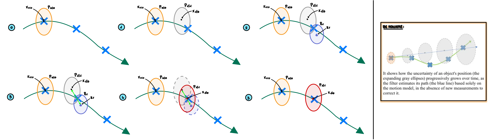

# 7-Tracking

Done?: Done
Select: theory

# 1. Introduction

<aside>
💡

**Tracking system** tries to follow a target over time, it consists of:

1. **Identifying the shape and position of the object with spatial coherence.** In particular objects can be detected by: shape and motion
2. **Maintaining the temporal coherence over time** [maintaining the object identification frame-by-frame (re-identification)]

General assumptions:

- Camera is fixed
- Camera is static
- Camera is calibrated

Depending on complexity, tracking can involve:

- **Single Object Tracking (SOT)** → tracking one object
- **Multiple Object Tracking (MOT)** → tracking multiple objects with identity maintenance
- **Multiple Camera Multiple Target (MC-MTT)** → tracking across camera networks
</aside>

<aside>
🚨

Tracking is **difficult** due to high variability in: light changes, object aspect (surface cover, specularity, transparency, shape), object/camera motion (non-smooth, incoherent), and scene context (clutter, confusion, occlusion, low contrast, long durations).

</aside>

---

# 2. Tracking Methods

## 2.1. Approaches

1. **Depending on embedding:**
    - **Traditional / model-driven** → features representing the object are **handcrafted**.
    - **Deep learning / data-driven** → features representing the object are **learned from data**. Usually more effective, but also more computationally expensive.
2. **Depending on the application:**
    - **Object-specific tracking** → focuses on a **particular object** of interest.
    - **Generic tracking** → aims to track **all objects** entering the scene.
3. **Depending on data gathering method:**
    - **Online tracking** → performed **in real-time**.
    - **Offline tracking** → the entire video sequence is gathered **before processing**.
4. **Depending on the paradigm used:**
    - **Tracking by detection:**
        1. Run a detector at each frame (e.g., YOLO) to locate the object(s).
        2. Associate bounding boxes of the same object across frames to build trajectories.
        
        **Advantages:** very robust to occlusion, if we cannot see the object in a frame we just wait until we detect it again, this feature is called tracking re-initialization.
        
        **Disadvantages:** 
        
        - Computationally expensive (detection at every frame)
        - Performance highly depends on the detector quality
    - **Detection by tracking →** the **optical flow** is computed to follow pixels or regions over time:
        1. Detect the object once at the start (or every *N* frames).
        2. Use a tracker (e.g., Optical Flow + Kalman Filter) to follow it across frames.
        3. If the tracker loses the object → perform detection again.
        
        **Advantages:** faster than TbD (no detection at every frame).
        
        **Disadvantages:** 
        
        - Sensitive to drift (object may be gradually lost)
        - Fails under occlusion (if the object disappears, tracking is lost)
5. **Tracking by attention:** focuses computational resources on regions where the object is likely to appear.
6. **Tracking by regression:** directly predicts object position in the next frame using regression models.

## 2.2. Algorithm Categories

### 2.2.1. Single Object Tracking (SOT)

SOT is most oriented towards **Detection by Tracking** (motion + modeling). There are different implementations:

- **NCC (Normalized Cross-Correlation)** → template matching with NCC on nearby patches (no information about motion)
    
    **Considerations:**
    
    - inefficient brute force search
    - the search is limited to a fixed neighborhood
    - assumption that object doesn’t change shape
- **Siamese Network (DL)** → generalize NCC using deep learning.

### 2.2.2. Multiple Object Tracking (MOT)

MOT is more oriented towards **Tracking by Detection**. There are different implementations:

- **SORT (Simple Online Real-time Tracking)**
- **Deep SORT**

## 2.3. The Kalman Filter (Probabilistic Model-Driven Tracking)

In **detection by tracking**, we need an algorithm called a **tracker**, which after the initial detection, allows us to keep tracking the object without requiring new detections at each frame. The main probabilistic tracking algorithm is the **Kalman filter**.

<aside>
💡

**Core Concept**

The Kalman filter works by modeling an object's state and its evolution over time. This process involves two main steps: **prediction** and **update.**

- **Object state** ($\hat{x_t}$) → a vector that summarizes the object's key information at time $t$. This is our **best estimate** (indicated by the "hat" symbol) of the object's true state:
    
    $$
    \hat{x}_t =
    \begin{pmatrix}
    x_t \\ y_t \\ \dot{x}_t \\ \dot{y}_t
    \end{pmatrix} 
    $$
    
    Where $x_t$, $y_t$ are the position coordinates and $\dot{x}_t$, $\dot{y}_t$ are the velocities.
    
- **Covariance Matrix ($P$)** → this matrix quantifies the **uncertainty** in our state estimate. A large $P$ means low confidence, while a small $P$ means high confidence.
- **Object Observation ($z_t​$)** → a vector representing the direct measurements obtained from a sensor or detection method (like blob detection). It typically includes only the position:
    
    $$
    z_t = \begin{pmatrix} x_t \\ y_t \end{pmatrix}
    $$
    
</aside>

### 2.3.2. The two steps cycle

The Kalman filter operates in a continuous cycle of prediction and update, which can be visualized as a cycle of a priori (predicted) and a posteriori (updated) estimates.

1. **Prediction Step:** this step predicts the object's new state and its uncertainty based on its previous state and a **motion model**. It's a forward-looking step that projects the current state into the future.
    
    <aside>
    📌
    
    **Probabilistic Model:**
    
    The prediction is modeled as a **normal (Gaussian) distribution**. The predicted state is the mean of this distribution, and its uncertainty is the covariance:
    
    $$
    P(x_t \mid x_{t-1}) = N\!\big(F_t \hat{x}_{t-1 \mid t-1}, \, Q_t\big)
    $$
    
    Where:
    
    - $Q_{t}$  → prediction noise covariance
    - $F_{t}$ → state transition matrix, representing the motion model
    </aside>
    
    **Practical Formulas:**
    
    - **State prediction:**
        
        $$
        \hat{x}_{t\mid t−1}=F_t\hat{x}_{t−1\mid t−1}=\begin{pmatrix} x_{t-1} \\ y_{t-1} \\ \dot x_{t-1} \\ \dot y_{t-1} \end{pmatrix} \cdot \begin{pmatrix}a_{11} & a_{12} & a_{13} & a_{14} \\. & . & . & . \\. & . & . & . \\a_{41} & a_{42} & a_{43} & a_{44}\end{pmatrix}
        $$
        
    - **Covariance Prediction:**
        
        $$
        P_{t \mid t-1} = F_t P_{t-1 \mid t-1} F_t^T + Q_t
        $$
        
    
    **N.B.** After this step, we have a predicted state $x_t$ and its associated uncertainty $P_{t}$. This is the "a priori" estimate.
    
2. **Update Step:** in this step, the filter uses the new observation ($z_t$) to correct the predicted state.
    
    <aside>
    📌
    
    **Probabilistic Model:**
    
    The final, updated state is the result of combining two Gaussian distributions: the predicted state and the new measurement. This fusion is described by the multiplication of probabilities:
    
    $$
    P(x_t \mid x_{t-1}, z_t) \propto P(z_t \mid x_t) \cdot P(x_t \mid x_{t-1})
    $$
    
    </aside>
    
    **Practical Formulas:**
    
    - **Evaluate Innovation:**
        - The **innovation** is the difference between the actual measurement and the predicted measurement: $\tilde{y}_t = z_t - H_t \hat{x}_{t \mid t-1}​$
        - The **innovation covariance** is the uncertainty of this difference: $S_t = H_t P_{t \mid t-1} H_t^T + R_t$
        
        **N.B. $R_t$** is the **covariance of the measurement noise**. It's an **input parameter** you must provide to the algorithm.
        
        **N.B**. $H_t$ is the **observation matrix**. Its job is to **map the state vector ($x_t$) to the observation vector ($z_t$):**
        
        $$
        H_t \hat{x}_{t \mid t-1} = \begin{pmatrix} 1 & 0 & 0 & 0 \\ 0 & 1 & 0 & 0 \end{pmatrix} \begin{pmatrix} \hat{x}_{t \mid t-1} \\ \hat{y}_{t \mid t-1} \\ \dot{x}_{t \mid t-1} \\ \dot{y}_{t \mid t-1} \end{pmatrix} = \begin{pmatrix} \hat{x}_{t \mid t-1} \\ \hat{y}_{t \mid t-1} \end{pmatrix}
        $$
        
    - **Kalman Gain ($K_t$):** this is the key component that determines how much the new observation influences the final state estimate:
        
        $$
        K_t = P_{t|t-1} H_t^T S_t^{-1}
        $$
        
        - Large $K_t$ → more trust is placed in the new **observations** → $P_t$ high and $R_t$  low
        - Small $K_t$ → more trust is placed in the **predictions** → $P_t$ low and $R_t$  high
    - **State Update:** the predicted state is corrected by adding a scaled version of the innovation: $\hat{x}_{t \mid t} = \hat{x}_{t \mid t-1} + K_t \tilde{y}_t$
    - **Covariance Update:** the uncertainty is reduced after incorporating the new information: $P_{t \mid t} = (I - K_t H_t) P_{t \mid t-1}​$
    
    **N.B.** This final estimate, which incorporates the observation, is the "a posteriori" estimate. The cycle then repeats, with this updated state becoming the new starting point for the next prediction.
    

<aside>
🚨

**Limitations:**

Only works well when the **system is linear. I**n simple words it works if there are not fast accelerations, curve trajectories,…thus it doesn’t work well for some tasks like  football ball tracking.

</aside>

---

# 3. Tracking metrics

- **Intersection over Union (IoU)** → let $GT_i$  be the ground truth bounding box in the current frame and $D_i$ the detected bounding box. A detection is considered successful when the overlap between the two, expressed as their intersection over union, is higher than a given threshold (commonly 0.5):
    
    $$
    \frac{|D_{i} \cap GT_{i}|}{|D_{i} \cup GT_{i}|} \ge \tau
    $$
    
- **F1-Score** → first we compute the F-Score:
    
    $$
    F = 2 \cdot \frac{\text{precision} \cdot \text{recall}}{\text{precision} + \text{recall}}
    $$
    
    - This formula can be computed at object level:
        1. We use IoU to calculate the number of detected objects that are **false positive**, **true positive**, **false negative** or **true negative.**
        2. We use this data to compute **precision** and **recall:**
            
            $$
            precision = \frac{tp}{tp+fp}\quad recall = \frac{tp}{tp+fn}
            $$
            
    - Or it can be computed at pixel level:
        
        $$
        \text{precision} = \frac{tp}{tp + fp} \quad\text{recall} = \frac{tp}{tp + fn}
        $$
        
    
    Once the F-Score is available for each frame, the **F1-Score** over the whole sequence is simply the average:
    
    $$
    \text{F1} = \frac{1}{N_{\text{frames}}} \sum_{i=1}^{N_{\text{frames}}} F
    $$
    
- **Object Tracking Accuracy (OTA) →** it penalizes both false positives and false negatives relative to the total number of ground truth objects in each frame:
    
    $$
    \text{OTA} = 1 - \frac{\sum_{i=1}^{N_{\text{frames}}} (fp + fn)}{\sum_{i=1}^{N_{\text{frames}}} g_i}
    $$
    
    Where $g_i$ is the number of ground truth objects present in the $i$ -th frame.
    
- **Object Tracking Precision (OTP) →** it ****averages the IoU of matched bounding boxes across the sequence:
    
    $$
    OTP = \frac{1}{|M_s|} \sum_{i \in M_s} \frac{|D_i \cap GT_i|}{|D_i \cup GT_i|}
    $$
    
    Where $M_s$  is the set of all the frames where the detected bounding box matches the ground truth bounding box.
    
- **Deviation** → it captures how far the predicted bounding box centers are from the ground truth centers. It is defined as:
    
    $$
    \text{Deviation} = 1 - \frac{\sum_{i \in M_{s}} \text{euclidean\_distance}(CD_{i}, CGT_{i})}{|M_{s}|}
    $$
    
    Where 
    
    $CD_i$ and $CGT_i$ denote the detected and ground truth centers respectively.
    

---