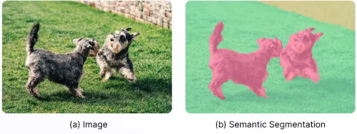
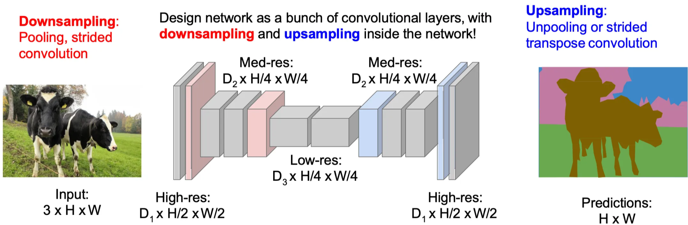
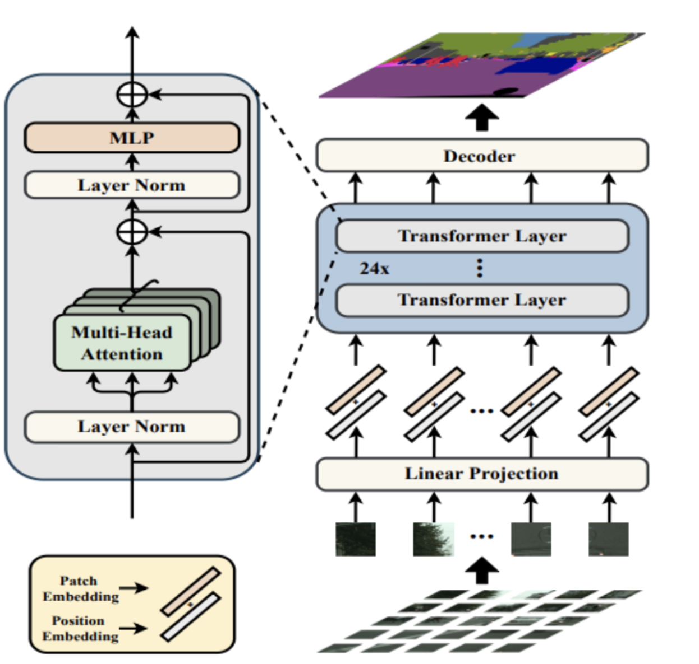

# L6-Segmentation

Done?: Done
Select: lab

# 1. Introduction

<aside>
💡

**Segmentation** is the task of assigning to each pixel of the images a label among a set of predefined classes according to its visual content. Segmentation can be done in two main ways:

- **Semantic segmentation** → we do not separate different instances of the same class
    
    
    
- **Instance segmentation** → we segment each different instance of the same class separately
    
    
    
</aside>

## 1.2. Things vs Stuff

In segmentation tasks, a useful distinction is often made between "*Things"* and "*Stuff*":

- **Things** → countable objects that have a well-defined shape and a distinct identity, such as a person, a car, or a cat. Tasks like instance segmentation are particularly focused on identifying "*Things*".
- **Stuff** → amorphous regions without a clear shape or individual identity, such as ‘*road*‘, ‘*grass*‘, or ‘*sky*‘. Semantic segmentation is well-suited for ”*Stuff*”.

---

# 2. Semantic Segmentation Methods

1. **Early approach: Sliding Window**
    
    
    1. Slide a window over the entire image
    2. Apply a CNN classifier to the window and assign the predicted label to the central pixel
    3. Repeat this process for every pixel in the image
    4. Group together pixels that share the same label
    
    
    
    **Problem:** this approach is extremely computationally expensive because the CNN must be applied to every patch, essentially one for each pixel. In addition, it only uses local information from each patch, and overlapping patches do not share computations, resulting in a lot of redundant work.
    
2. **Modern approach: Fully Convolutional Networks (FCN)** → these networks process the entire image in a single pass, making them far more efficient.
    
    
    - **Without Downsampling** → a CNN take the full image as input and output a label map of the same resolution, where each pixel’s value corresponds to its class.
        
        **Problem:** CNNs naturally reduce the spatial dimensions of the input as it passes through the layers.
        
        <aside>
        ✅
        
        One naive **solution** would be to remove all sources of downsampling (stride, padding, pooling). However this is not a very good solution for two main reasons:
        
        - It drastically increases the number of parameters
        - The receptive field of the kernels does not grow, limiting context information for each pixel
        </aside>
        
    
    
    
    - **With downsampling and upsampling** → ****the most effective way to produce an output of the same resolution as the input is to use an **autoencoder-like architecture.** The encoder performs downsampling like a regular CNN and the decoder performs upsampling.
        
        
        

---

# 3. Upsampling Techniques

Upsampling in CNNs can be achieved through 2 main mechanisms: 

- **Unpooling** → is the reverse of pooling in classical CNNs, and there are several ways to perform it:
    - **Nearest Neighbour**: each value from the input feature map is simply replicated to fill a larger block in the output map
    - **Bed of Nails**: ****places each input value at a specific corner (e.g., top-left) of a block and fills the rest with zeros
    - **Max Unpooling**: during the max-pooling operation in the encoder, the index of the maximum value in each window is stored. The decoder then uses these indices to place the values back into their original locations during upsampling, filling other positions with zeros
    
    
    
- **Transpose Convolution** → is a reverse operation of a standard convolution. It allows us to start from a low-resolution feature map and generate a higher-resolution output. The process works as follows:
    
    
    1. Iterate over each element of the input
    2. Multiply each input element by a learnable $k \times k$ kernel. This kernel is then laid onto the output feature map (initialized to zero), following the rules of padding and stride
    3. If kernels overlap, the values are summed at the overlapping positions, producing the final upsampled output.
    
    
    
    <aside>
    📌
    
    **Shape:**
    
    Given an input feature map of shape $(n, iC, H, W )$, a transpose convolution with kernel shape $(oC, iC, kH, kW )$ produces an output of shape $(n, oC, oH, oW )$. The output height $(oH)$ and width $(oW )$ are computed as:
    
    $$
    oH=(H−1)×stride[0]–2×padding[0]+dilation[0]×(kH–1)+1\\oW=(W−1)×stride[1]–2×padding[1]+dilation[1]×(kW–1)+1
    $$
    
    where $kH$, $kW$ are kernel height and width, and stride, padding, and dilation are hyperparameters of the transpose convolution.
    
    </aside>
    
    <aside>
    ✖️
    
    **Transpose convolution as a Matrix Multiplication**
    
    We can express standard convolution as a matrix multiplication:  $\vec{x}\ *\ \vec{a}=X\vec{a}$ . For example, in the case of a 1D convolution with $\text{kernel size} = 3$, $\text{stride} = 2$, and $\text{padding} = 1$, the operation can be represented as:
    
    $$
    \begin{bmatrix}
    x & y & z & 0 & 0 & 0 \\
    0 & 0 & x & y & z & 0
    \end{bmatrix}
    
    \begin{bmatrix}
    0 \\
    a \\
    b \\
    c \\
    d \\
    0
    \end{bmatrix} = \begin{bmatrix}
    ay+bz \\
    bx+cy+dz
    \end{bmatrix}
    $$
    
    In **transpose convolution**, instead of multiplying by this matrix $X$, we multiply by its **transpose** $X^T$. Using the same example parameters, the transpose convolution can be shown as:
    
    $$
    \begin{bmatrix}
    x & 0 \\
    y & 0 \\
    z & x \\
    0 & y \\
    0 & z \\
    0 & 0
    \end{bmatrix}
    \begin{bmatrix}
    a \\
    b 
    \end{bmatrix}=
    \begin{bmatrix}
    ax \\
    ay \\
    az + bx \\
    by \\
    bz \\
    0 
    \end{bmatrix}
    $$
    
    </aside>
    

**N.B.** Info before or after upsampling can be merged with **skip connection**. 

<aside>
💡

**How Skip Connection Works?**

- The first CNN layers produce **fine-grained feature maps** (high resolution), but capture **less meaningful** information.
- The last CNN layers produce a less fine-grained feature maps (low resolution) that capture **high-level** information.

The idea is to merge all these information together, with the following steps:

1. A deeper feature maps is upsampled to an intermediate resolution (e.g. a 1/32 resolution feature map to 1/16 resolution).
2. The upsampled feature map is then added (or concatenated) with a middle-depth feature map that already has the same intermediate resolution (e.g. 1/16)

This process can be repeated multiple times in order to englobe information from many levels.  

</aside>

---

# 4. Models

- **U-Net →** uses skip connections + transpose convolution
- **Seg-Net** → ****uses Max Unpooling

---

# 5. Evaluation Metrics

The standard evaluation metric for segmentation tasks is **Intersection over Union (IoU)**. To obtain a more balanced evaluation, it is common to compute IoU separately for each class and then average the results across all classes.

---

# 6. Segmentation Transformer (SETR)

The **Vision Transformer (ViT)** divides the input image into a fixed number of patches, converts them into embeddings, and processes them through self-attention. The output is the same number of vectors, one for each patch. 

The key advantage of attention is that it naturally provides a **global receptive field**, ****there is no need for additional mechanisms to expand it, since every patch can directly interact with every other.

At the end of the transformer encoder, however, we only have **patch-level predictions**. To recover pixel-level predictions for segmentation, we attach a **decoder network**. The decoder inverts the embedding process, mapping patch representations back to full-resolution spatial outputs.

---

# 7. SegmentAnything (SAM) [Meta, 2023]

SegmentAnything is a model designed to perform promptable segmentation: along with the input image, the user provides a prompt (text, points, bounding boxes) to indicate what has to be segmented.

Its architecture consists of three components:

- **A lightweight prompt encoder** that turn the user prompts into embeddings
- **A large visual transformer** (image encoder) that extracts high level features
- **A transformer-based lightweight mask decoder** that merges this information to produce a segmentation mask

**N.B.** One of SAM’s remarkable capabilities is **Open-Vocabulary Segmentation**, ****the ability to segment objects specified by a textual prompt, even if the category was never part of its supervised training.

---

# 8.  Open-vocabulary Segmentation

**Open-Vocabulary Segmentation (OVS)** is the ability of a model to **segment and classify objects** in a image using **any category specified in natural language**, even if that specific category was **not present** in the model’s training dataset. These models are generally **pre-trained on billions of image–text pairs**, enabling them to generalize to unseen concepts.

## 8.1. CLIP (Contrastive Language-Image Pretraining) [OpenAI, 2021]

CLIP is a vision–language model trained with two encoders:

- A **text encoder** that maps sentences into vectors
- An **image encoder** that maps images into vectors

Given a batch of $N$ text–image pairs $\{(I_1, T_1), \dots, (I_N, T_N)\}$:

1. Each image and text is encoded into a vector
2. A similarity score (dot product or cosine similarity) is computed between every image vector and every text vector
3. The training objective maximizes similarity for matching pairs and minimizes similarity for mismatches

**N.B.** After training, both images and text live in the same embedding space.

---

## 8.2. Training Clip

The process for a single batch of $N$  (image, text) pairs is as follows:

1. All $N$ images are passed through the **Image Encoder** $f$ to produce a set of $N$ image feature vectors: $[f (I_1), f (I_2), . . . , f (I_N)]$.
2. Similarly, all $N$ text descriptions are passed through the **Text Encoder** $g$ to produce a set of $N$ text feature vectors: $[g(T_1), g(T_2), . . . , g(T_N)]$.
3. A **square similarity matrix** of size $N \times N$ is computed. The element at position $(i, j)$ in this matrix is the cosine similarity between the $i$-th image feature vector and the $j$-th text feature vector, calculated as their dot product after L2-normalization.

The goal is to **jointly optimize** the parameters of both encoders so that:

- The **cosine similarity scores along the diagonal** (correct pairs) are **maximized**.
- The **off-diagonal similarity scores** (incorrect pairs) are **minimized**.

This is done using a **symmetric cross-entropy loss.**

<aside>
📌

**Symmetric Cross-Entropy Loss**

The **symmetric cross-entropy loss** minimizes prediction error **in both directions** simultaneously:

- **Image-to-Text Loss:**
    - Compute the **softmax across each row** of the similarity matrix. This gives the probability that a given image corresponds to each text.
    - Apply che **cross-entropy**: $\displaystyle Loss_{\text{ImageText}}=-\sum_iy_i\log(p(y_i))=-\frac{1}{N}\sum_{i=1}^N\log\left(\frac{e^{(\frac{T_i\cdot I_i}{\tau})}}{\sum_{j=1}^N e^{(\frac{I_i\cdot T_j}{\tau})}}\right)$
- **Text-to-Image Loss:**
    - Compute the **softmax across each column** of the similarity matrix. This gives the probability that a given text corresponds to each image.
    - Apply **cross-entropy**: $\displaystyle Loss_{\text{TextImage}}=-\sum_iy_i\log(p(y_i))=-\sum_iy_i\log(p(y_i))=-\frac{1}{N}\sum_{i=1}^N\log\left(\frac{e^{(\frac{T_i\cdot I_i}{\tau})}}{\sum_{j=1}^N e^{(\frac{I_j\cdot T_i}{\tau})}}\right)$

The total loss is the average of the two directions:

$$
Loss = \frac{Loss_{\text{Image}\rightarrow\text{Text}}+Loss_{\text{Text}\rightarrow\text{Image}}}{2}=-\frac{1}{2N}\sum_{i=1}^N\left(

\log\left(
\frac{e^{(\frac{I_i\cdot T_i}{\tau})}}{
\sum_{j=1}^N e^{\frac{I_i\cdot T_j}{\tau}}}
\right)+
\log\left(
\frac{e^{(\frac{I_i\cdot T_i}{\tau})}}{
\sum_{j=1}^N e^{\frac{I_j\cdot T_i}{\tau}}}
\right)

 \right)
$$

</aside>

## 8.3. Zero-Shot Prediction with CLIP

Because CLIP is not trained on a closed set of classes but on the general alignment between text and images, it can perform **zero-shot classification**, ****this means that CLIP can perform classification on **categories never seen before** without retraining or fine-tuning.

The trick is to rephrase class labels as natural language prompts. For example, the label set [“dog”, “cat”, “giraffe”] is reformulated as [“a picture of a dog”, “a picture of a cat”, “a picture of a giraffe”]. Classification is then performed by comparing the input image embedding with these textual embeddings and choosing the one with the highest similarity.

## 8.4. Two-Stage Open-Vocabulary Segmentation with CLIP

A common approach combines **segmentation proposal networks** with CLIP:

1. A proposal network generates **candidate segmentation masks**, similar to the region proposal mechanism in object detection. The masks identify potential object regions without assigning categories
2. Each mask is used to crop the corresponding region from the image
3. CLIP is applied to classify each cropped region using natural language prompts

This yields open-vocabulary segmentation.

**Disadvantages:**

- Computationally inefficient: thousands of masks may need to be generated and classified.
- Redundant proposals: overlapping masks waste computation.
- Performance heavily depends on the **quality of the mask proposals**.

---