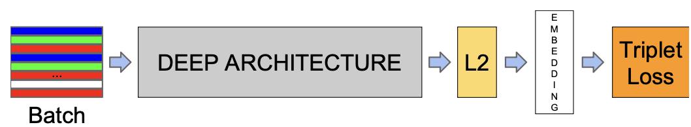

# z-Face-Net

Done?: Done
Select: lab

FaceNet (developed by Google) is a deep learning system for face recognition that maps facial images directly to a **128-dimensional feature vector**. 

Starting from a batch of images, we use:

- A **CNN Backbone** as a feature extractor
- **L2 normalization**

FaceNet learns a representation where geometric distances directly correspond to a measure of face similarity:

- Faces of the **same person** are close to each other.
- Faces of **different people** are far apart.

<aside>
📌

**The Triplet Loss**

The core innovation of FaceNet is the **Triplet Loss** function used during training. We compute the distance **from** our embedding (Anchor) to one embedding belonging to the same class (Positive) and another belonging to a different class (Negative). Our goal is to **minimize** the distance between embeddings of the same class and **maximize** the distance between embeddings of different classes.

</aside>

---

# Siamese Network

- 2 Input images are passed respectively toward 2 CNN having the same weights.
- The CNNs create 2 embedding and we compute the difference between them.
- It uses the Contrastive Loss

<aside>
📌

**Contrastive Loss**

Contrastive Loss operates on **pairs of images**. Its objective is to:

- **Minimize** the distance between embeddings of **matching** pairs.
- **Maximize** the distance between embeddings of **non-matching** pairs.
</aside>

---