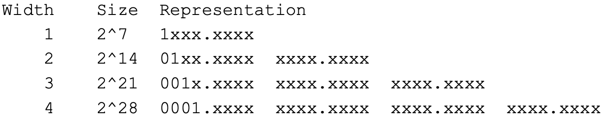

# 10-Containers

In this chapter, we will discuss *Container Formats*, which were created to meet the need for combining different types of data, such as audio, video, subtitles, and more, into a single file. A *container*, in our case, is a file that allows multiple streams to be stored together, even if they are not continuous.

There are various container formats, such as AVI, MP4, M4A, and in our case, we will focus on **MKV (Matroska)**.

# 10.1 EBML (ExtensibleBinary Meta Language)

EBML is a byte-aligned binary markup format used by Matroska to structure and store data within a binary file. Much like XML or JSON, EBML separates syntax from semantics. Each file must contain exactly **one** header, which defines the structure of the rest of the file and enables the correct interpretation of its content. EBML supports a variety of data types, including:

- **Signed Integer**: Big-Endian format, ranging from 1 to 8 octets **[Q]**
- **Unsigned Intege**
- **Float**: Big-Endian, either 4 or 8 octets (32 or 64 bits)  **[Q]**
- **String**: ASCII-encode
- **UTF-8**: Unicode.
- **Dat**
- **Master Element**.
- **Binary**

EBML elements can also be structured hierarchically. Some elements, known as *Master Elements*, can contain other EBML elements, enabling the representation of complex data structures.

## 10.1.1 EBML Element

Each EBML element has the following structure:

$$
<ID>\quad <Size>\quad <Data>
$$

- The **ID** field is an identifier of the EBML element type (not of the data type contained in the data field)
- The **size** field indicates the size of the data contained in the data field
- The **data** field contains the actual data

Both the ID and Size fields are encoded as variable-length integers. In particular, the ID field can occupy between **1 and 4 bytes [Q]**, depending on its value. The size in bytes (of the ID field) can be determined using the number of zeros + 1 starting from the most significant bit **[Q]**:

Since it is mandatory for IDs to represent values with as few bytes as possible, fewer values are available for each class **[Q (the image)]**:

As for the **“size”** field, it can be represented using **between 1 and 8 bytes**, depending on the value being encoded **[Q (and also the image)]**:

---

# 10.2 Matroska

The Matroska format is an open container format that allows you to store in the same file an arbitrary number of tracks, of video, audio or text type (e.g. subtitles).

Matroska file at its highest level (level 0) is composed of two elements ***header*** and ***segment:***

## 10.2.1 Segment

It contains all the level 1 EBML elements indicated in the Matroska format:

- SeekHead: contains an index of where all the other level 1 elements are located within the file (since they can be in any order) **[Q]**, it’s not mandatory because to find out the position of the other level 1 elements you can simply scroll through the file. It has a very simple structure, it maintains key-value pairs called Seeks
that contain IDs and locations:
    
    $$
    <SeekID>\quad <SeekPosition>
    $$
    
    <aside>
    
    **Example:**
    
    
    
    </aside>
    
- SegmentInfo: contains generic information on the entire file.
    
    <aside>
    
    **Example:**
    
    
    
    </aside>
    
- Tracks: contains information on all the tracks present in the file, one of the trackEntries is:
    - TrackType: an 8-bit integer for the track type (1: video, 2: audio, 3: complex=audio and video combined, 0x10: logo, 0x11: subtitle, 0x12: buttons, 0x20: control) **[Q]**
- Chapters: contains information on the chapters in which the file is divided
- Clusters: Clusters are the elements that contain the encoded binary data of the various tracks. Within the Segment there are many clusters, which contain blocks (called SimpleBlock or BlockGroup) of data, each of which is tied to a single track.
    
    <aside>
    
    **Example:**
    
    
    
    </aside>
    
    In addition to blocks, a cluster contains some other important elements:
    
    - Timecode (mandatory): contains an absolute timestamp of the cluster (always based on the TimecodeScale present in the SegmentInfo) **[Q]**
    - PrevSize: contains the size in bytes of the previous cluster, not mandatory but useful for playback or backward search **[Q]**
    
    <aside>
    💡
    
    **SimpleBlock and BlockGroup**
    
    You can use two types of element to hold the encoded tracks data: 
    
    - **SimpleBlock** → binary element that directly contains data
    - **BlockGroup** → is instead a master element that can also contain other elements, among which the most important are:
        - Block: the binary element containing the data.
        - BlockDuration: the duration of the **block** expressed in relation to the TimecodeScale.
        - ReferenceBlock: contains the timestamp of another frame to be used as a reference (to indicate relationships between frames of type B and P and a frame of type I).
    
    Within a **Block** we find a header with the following elements:
    
    - Track Number: the Track number to which the data contained in the Block belongs, it is an integer stored as a VINT of the EBML format.
    - Timecode: a 16-bit signed integer relating to the timecode of the cluster to which the Block belongs **[Q]**.
    - Flags: one byte of flags:
        
        
        
    </aside>
    
- Cues: contains information on where you can jump in playing the file.
- Attachment: is a section that can contain any type of file.
- Tagging: contains all kinds of information about the tracks, like the ID3 tags of MP3 files.

---