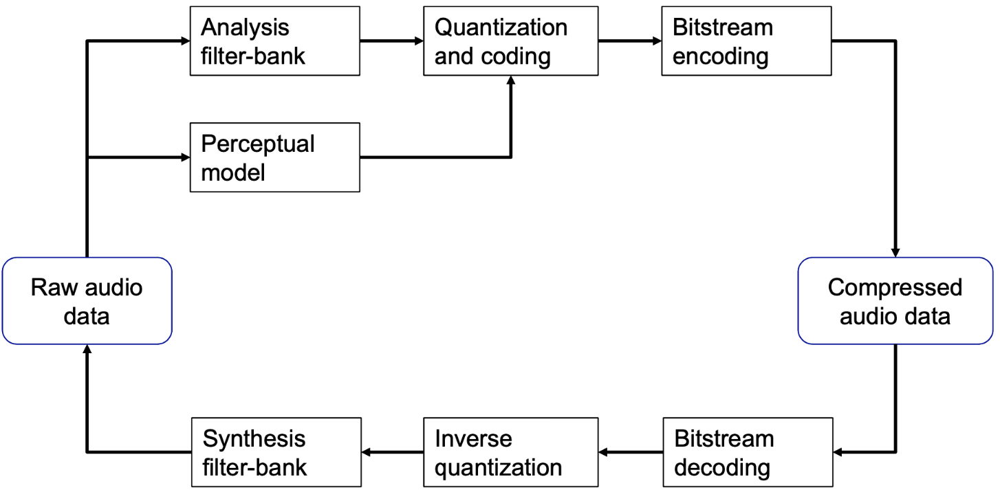
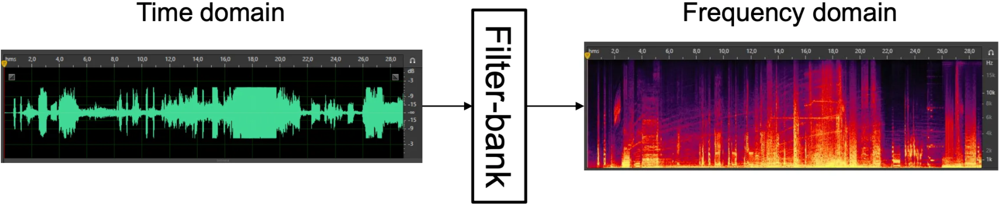

# 9-AAC

**AAC (Advanced Audio Coding)** is a lossy audio coding format, meaning it reduces file size by selectively discarding some audio information. It was designed as the successor to MP3 and is defined within the MPEG (Moving Picture Experts Group) standards. While AAC introduces numerous improvements, its general encoder structure shares similarities with MP3 encoders. Both MP3 and AAC are fundamentally **perceptual audio coding systems**.

<aside>
🔑

**Core features:**

AAC is a highly versatile and efficient audio format, offering:

- **Sampling Frequencies:** It can process audio signals sampled at rates ranging from 8 kHz up to 96 kHz, providing significant flexibility for various audio quality requirements.
- **Multichannel Support:** AAC supports a robust multichannel setup, allowing for up to 48 regular audio channels plus up to 16 additional LFE (Low Frequency Effect) channels. These LFE channels are dedicated to audio signals in the 3 to 120 Hz band, primarily for subwoofer use, making it suitable for complex surround sound configurations.
- **Bit Rate Flexibility:** It supports both CBR (Constant Bit Rate) coding, where the data flow is constant, and VBR (Variable Bit Rate) coding, which dynamically adjusts the bit rate based on the audio's complexity to optimize both quality and file size.
</aside>

---

# 9.1. P**erceptual encoding/decoding system**

A **perceptual encoding/decoding system** typically consists of the following blocks:

One phenomenon that occurs is known as **quantization noise** → a new signal created by the difference between the original signal and the quantized one. This is not acceptable because it is too noticeable to the human ear. Therefore, we want to **shape the noise** in a way that allows us to “hide” it.

What we aim to do is obtain a **quantized signal** from a **raw signal**: 

$x_q(n) = x(n) + e(n)$ in such a way that: 

$\arg\min_{e(n)} PE(x(n), e(n))$ [with $PE$ = *perceptual error*].

---

# **General Workflow**

## 1) **Sub-band Processing:**

<aside>
💡

To minimize the reconstruction error $e(n)$, we first move the signal into the frequency domain using a variant of the Discrete Cosine Transform known as the **MDCT (Modified Discrete Cosine Transform)**.

The goal of sub-band processing is to decompose the input signal into frequency components (sub-bands), which can then be processed or compressed individually. 

</aside>

### MDCT: Analysis

The MDCT is applied on overlapping windows of $2N$ samples from the input signal. Each window is multiplied by a window function $\omega_n$ and transformed as follows:

$$

X_k = \sum_{n=0}^{2N-1} x_n w_n \cos\left[\frac{\pi}{N} \left(n + \frac{1}{2} + \frac{N}{2}\right)\left(k + \frac{1}{2}\right)\right] \quad \text{for } k \in [0, N-1]
$$

From $2N$ input samples, we obtain $N$ MDCT coefficients. Each coefficient $X_k$ represents the energy in a specific frequency sub-band. This transformation is repeated over time using **overlapping blocks**, ensuring that each block shares half of its samples with the previous and next one.

**N.B.** To avoid losing information at the signal boundaries, the input is padded with $L$ zeros at both the start and end. 

### IMDCT: **Synthesis and Overlap-Add**

To reconstruct the signal in the time domain, the **Inverse MDCT (IMDCT)** is used:

$$

y_n = \frac{2}{N} w_n \sum_{k=0}^{N-1} X_k \cos\left[\frac{\pi}{N} \left(n + \frac{1}{2} + \frac{N}{2}\right)\left(k + \frac{1}{2}\right)\right] \quad \text{for } n \in [0, 2N-1]
$$

Because the MDCT is a **lapped transform**, perfect reconstruction requires combining overlapping segments. Specifically, each reconstructed block overlaps 50% with the previous one, and the final output is obtained by **adding the second half of the previous block to the first half of the current block**. This **overlap-add** method eliminates boundary artifacts and ensures signal continuity:

<aside>
📌

**Block Switching**
AAC processes audio in frames of 2048 samples and uses two window lengths for the MDCT:

- 2048 samples (standard)
- 256 samples that is used when a transient is detected, such as a drum hit

This technique, called ***block switching***, helps handle rapid changes in the audio signal. For each frame, if no transient is detected, a 2048-sample window is used producing 1024 MDCT coefficients. If a transient is detected, the frame is split into eight short windows of 256 samples each, generating 128 coefficients per window, totaling 8 × 128 coefficients.

</aside>

### **Blocking Artifacts and Windowing in AAC**

Processing blocks of $2L$ **samples** in the MDCT is equivalent to multiplying the signal by a **rectangular window**. This causes **spectral leakage** (=unwanted frequency components) due to the sharp edges of the window. In the frequency domain, this corresponds to a **sinc-shaped response** with **side lobes around –13 dB**, which leads to **blocking artifacts** between frames.

### **Reducing Spectral Leakage: Window Functions**

To minimize blocking artifacts and spectral leakage, AAC uses **smooth window functions** applied before both the **MDCT** and the **IMDCT**. Specifically, AAC supports two types of symmetric, energy-preserving windows:

1. **Sine Window →**  this window provides good time-frequency localization and continuity between blocks:
    
    $$
    
    w_n = \sin\left( \frac{\pi}{2N} \left(n + \frac{1}{2} \right) \right), \quad n \in [0, 2N - 1]
    $$
    
2. **Kaiser-Bessel-Derived (KBD) Window →** offers even better suppression of side lobes and is derived from the **Kaiser-Bessel window** $W’(p, \alpha)$. It is constructed as follows:
    
    $$
    
    w_n =
    \begin{cases}
    \frac{\sum_{p=0}^{n} W’(p, \alpha)}{\sum_{p=0}^{N} W’(p, \alpha)}, & n \in [0, N) \\
    \frac{\sum_{p=0}^{2N - n - 1} W’(p, \alpha)}{\sum_{p=0}^{N} W’(p, \alpha)}, & n \in [N, 2N)
    \end{cases}
    $$
    

<aside>
💡

**Why KBD Helps?** 

While KBD windows may still introduce some spectral leakage, the **amplitude of the unwanted frequency components is drastically lower** compared to those produced by a rectangular window. For instance:

- A **rectangular window** generates side lobes at approximately **–13 dB**, which can cause audible artifacts.
- A **KBD window**, on the other hand, reduces side lobe levels to **below –140 dB**, making them virtually inaudible.

Thanks to this strong attenuation of side lobes, the KBD window is highly effective in **minimizing perceptible distortion** and **preserving audio quality** in compressed signals.

</aside>

## 2) Perceptual Model

We’ve covered the mathematical aspects, now let’s look at how to integrate elements related to **psychoacoustics**. This involves incorporating prior knowledge about human hearing, taking into account several factors such as the 

- ***Absolute Threshold of Hearing →** c*onsidering the lowest sound level we can perceive, if something falls below that threshold, we cannot hear it. Therefore, we must ensure that the noise signal remains **below** this threshold.
- ***Critical Bands***
- ***Tone-Masking-Noise / Noise-Masking-Tone →** t*here are cases where a pure tone (e.g., a specific musical note) can mask noise, and vice versa:
    - When a **tone** masks noise, the noise can be up to **24 dB weaker** than the tone and still remain **inaudible** → the tone is a **good masker**.
    - When **noise** masks a tone, the tone only needs to be about **4 dB weaker** to become inaudible → the **noise** is a **much more effective masker**.
- ***Spread of Masking → t***he **masking effect** is not strictly limited to a single critical band it also extends to **neighboring bands**, meaning a sound can partially mask frequencies around it:
    - On the **lower-frequency side** (to the left), the masking effect rises sharply at about **+25 dB per Bark**.
    - On the **higher-frequency side** (to the right), it decays more gradually at about **–10 dB per Bark**.

<aside>
🔑

**Overall masking function**

Considering all the psychoacoustic effects, for a given signal it is possible to compute the **overall masking curve**. This curve represents the **minimum sound level (in dB SPL)** required for a sound to be audible at each frequency:

</aside>

## 3) Bit allocation and Quantization

For each frame the frequency coefficients are extracted and the masking threshold are used to determine how many bits to assign to each critical band:

- Coefficients in bands with **higher perceptual relevance** (i.e., far from the masking curve) receive **more bits**.
- Coefficients below the masking threshold can be quantized more aggressively (or even discarded).

<aside>
📏

### **Rate/Distortion Loop (Algorithm)**

Bit allocation is performed using a **rate/distortion optimization loop**, structured as follows:

1. **Initialization →** compute the total number of available bits:
    
    $$
    
    \text{available\_bits} = \frac{Br \cdot N}{Sr}
    $$
    
    Initialize a vector bits(band) ← 0 for all frequency bands.
    
2. For each band:
    - $\text{maxSPL}$ ← max spectral power in the band
    - $\text{minMT}$ ← min masking threshold in the band
    - $\text{SMR} = \text{maxSPL} - \text{minMT}$ (Signal-to-Mask Ratio)
    - Estimate **SNR** from number of bits $n$: $\text{SNR}_{\text{dB}} \approx 6.02 \cdot n + 1.761$
    - Compute **Noise-to-Mask Ratio** (NMR): $\text{NMR} = \text{SMR} - \text{SNR}$
3. **Iterative loop:**
    
    
    
    
    Elements used in the algorithm:
    
    - $bits$: vector of assigned bits (one value per band).
    - $NMR$: vector of perceptual errors (one value per band) (Noise to Mask Ratio).
    - $PE(b)$: function that evaluates the perceptual error for a specific band.
    - $num\_coeff(b)$: returns the number of spectral coefficients for a specific band.
    
</aside>

<aside>
📌

**Example:**

</aside>